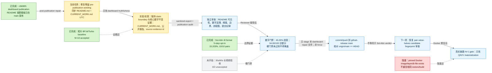

# 研究实时看板 / Live Research Dashboard（中文优先）

> **更新时间（UTC）：2026-08-13 14:34 UTC**<br>
> **进程状态：Argus continuous/active 科研工作流快照；当前阶段是已发布 `c5690f1f...` 看板后的真实性修复、审计和同步验证，Sol-Attn pair-value-halves 候选发布线仍暂停但未拒绝。**<br>
> **目前正在做什么：**修复已发布 GitHub README/CURRENT_WORK 中残留的 pre-publication wording，保持 30s/60s、短片 baseline、Sol-Attn 与 Docker blocker 边界不变；瞬时 PID、私有 provider、凭据和隐藏推理不是科学证据，不在公共 README 展示。

## 一眼结论（所有数字均带快照时间与证据版本）

- **证据加权总进度：45.00%**（权重表版本：`a6000-long-video-v2026-08-13-dashboard-1`；快照：2026-08-13 14:34 UTC）。该百分比只按已验收里程碑计分，未验收/被阻塞项目计 **0 进度信用**，不按文件数、commit 数、运行时长或主观感觉计分。
- **30s/60s 当前目标：**单张 RTX A6000 上的 720p 级 MiniMax-H3 FL2VA 长视频生产，先 30 秒可复现音视频链路，再 60 秒。
- **长视频产出：0/2 已验收目标**（30s：未验收；60s：未验收）。这是“验收计数为 0”，**不等于模型质量分为 0**；当前没有官方/hidden/held-out 长视频分数。
- **短片 accepted baseline：**原生 1344×768、124 帧、24 FPS、5.166667 秒短片已验收；BF16 warm N=10 median **1792.202 s**，Turbo 8-step N=10 median **290.998 s**（**6.159×** vs BF16），Turbo 4-step N=10 median **149.619 s**（**11.978×** vs BF16，质量风险更高）。
- **Sol-Attn 边界：**r8 真实 H3 5-step opt-in lane 已验收 **15.203%** median HTTP-time improvement（10/10 pairs，阈值 >3%），但不是 50-step BF16、长视频或语义质量结论。最新 pair-value-halves 仅为 **合成/无模型 kernel 证据**：total median **145.399 ms** vs current prefix-skip **175.567 ms**，`max_abs_valid=0`，仍默认关闭，尚无 H3 E2E/长视频/产品级 speedup。
- **Docker blocker：**pinned r2 base image 与 r8/r9 overlay image 当前在本地 Docker daemon 不可 inspect；r2 restore/build 在 layerdb 注册阶段失败（`file exists`）。在 admin 修复或干净 daemon 提供 pinned image 前，不重复同一 Docker restore/build，不运行真实链路 H3 gate。
- **下一真实链路 N=1 gate：**只改变 Q/K/V materialization；必须检查 dense fallback、输出/AV 正确性、copy bytes 和可比端到端时间。N=1 通过后才允许 N=3，再考虑 N≥10。
- **当前门禁评分（研究主线）：34.00/100，状态：BLOCKED/观察。**硬门禁“30s/60s 真实链路尚无已验收输出、Docker gate 阻塞”未通过，不能用综合分掩盖。

## 证据加权总进度表（100% 分母，可审计）

| 里程碑 | 权重 | 完成定义 | 当前信用 | 证据版本/路径 | 结论 |
|---|---:|---|---:|---|---|
| M1 公开基准合同、Schema、证据规范化、CPU/static 与 publication hygiene 基础 | 15% | `benchmark_contract/v1`、公开报告和 sanitized audit/review 基础可复核 | 15% | `benchmark_contract/v1/README.md`; `CURRENT_WORK.md` | 已验收基础能力 |
| M2 5.166667s 短片 BF16 fidelity denominator 与 Turbo practical accepted baseline | 20% | 同一物理 A6000，BF16/Turbo N=10；质量/结构边界公开 | 20% | `CURRENT_WORK.md`; `technical_report/minimax_h3_a6000_performance.md` | 已验收短片基线，不是长视频 |
| M3 Sol-Attn r8 formal matched 5-step opt-in lane | 10% | 10/10 matched pairs，median HTTP-time improvement 超过 3% 阈值，fail-closed 边界公开 | 10% | `technical_report/evidence/minimax_h3_desktop/sol_engine_port/sol_attn_h3_formal_n10_r8_n10_20260812T031757Z/formal_n10_decision.json` | 已验收但仅限 5-step opt-in |
| M4 pair-value-halves 去 materialization 假设进入真实链路 | 10% | 真实 H3 N=1 gate 通过；不是仅 synthetic/model-free harness | 0% | source evidence id `sol_attn_pair_value_halves_20260813T110953Z`; `CURRENT_WORK.md` | 合成证据保留，未验收真实链路 |
| M5 30 秒 720p 级可复现音视频链路 | 25% | 单 A6000 产生并验收 30s 输出；AV/质量/耗时边界通过 | 0% | `benchmark_contract/v1/lane-manifests/*30*`（extension/unmeasured）; `CURRENT_WORK.md` | 未测/被 Docker blocker 间接阻塞 |
| M6 60 秒 720p 级可复现音视频链路 | 15% | 单 A6000 产生并验收 60s 输出；AV/质量/耗时边界通过 | 0% | `benchmark_contract/v1/lane-manifests/*60*`（extension/unmeasured）; `CURRENT_WORK.md` | 未测 |
| M7 长视频重复性/泛化与最终发布边界 | 5% | 30/60s 通过后再做多 prompt/seed、N≥3/N≥10、人工质量与 claim 审查 | 0% | 待生成 | 未开始 |
| **合计** | **100%** |  | **45.00%** | 快照：2026-08-13 14:34 UTC | 未验收项未给进度信用 |

## 当前量化效果（N/A/blocked 不写成 0）

| 指标 | 当前值 | Baseline/对照 | Delta | n/denominator | 不确定性/适用边界 | 好/中/差阈值 | 当前结论 | 证据路径 |
|---|---:|---:|---:|---:|---|---|---|---|
| 30s 长视频验收 | N/A（未测；验收计数 0/1） | N/A | N/A | 0/1 accepted target | pinned path 原生只支持 4–15s；真实链路 gate 未运行 | 好=30s N=1 AV+质量+耗时验收；中=结构通过但质量待审；差=失败/泄漏/不可复现 | 未验收，不把 N/A 记作耗时 0 或质量 0 | `CURRENT_WORK.md`; `benchmark_contract/v1/README.md` |
| 60s 长视频验收 | N/A（未测；验收计数 0/1） | N/A | N/A | 0/1 accepted target | 需先通过 30s gate | 好=60s N=1 验收；中=30s 通过但 60s 未测；差=失败/不可复现 | 未开始/未验收 | `CURRENT_WORK.md` |
| 长视频总产出 | 0/2 已验收目标 | N/A | N/A | 0/2 accepted targets | 这是验收计数，不是模型质量分 | 好=2/2；中=1/2；差=0/2 | 当前为 0/2 unaccepted | 本看板 + `CURRENT_WORK.md` |
| BF16 短片 fidelity denominator | median **1792.202 s** | 自身为 fidelity 分母 | N/A | warm N=10 | 1344×768、124 帧、24 FPS、5.166667s；同一物理 A6000 | 好=可复现 N=10 分母；差=无分母 | 已验收短片分母 | `technical_report/minimax_h3_a6000_performance.md`; `CURRENT_WORK.md` |
| Turbo 8-step practical | median **290.998 s** | BF16 1792.202 s | **6.159×** faster | N=10 | disclosed practical approximation，不是 BF16 fidelity | 好=结构/质量边界通过且 >5×；中=2–5×；差=<2×或质量失败 | 推荐 practical 默认短片路线 | `CURRENT_WORK.md`; `technical_report/minimax_h3_a6000_performance.md` |
| Turbo 4-step experimental | median **149.619 s** | BF16 1792.202 s | **11.978×** faster | N=10 | 质量风险更高，24-case 中视觉 11/12 | 好=>10×且质量通过；中=>5×但质量风险；差=质量失败 | 快但非默认 | `CURRENT_WORK.md` |
| Sol-Attn r8 formal 5-step opt-in | median HTTP-time improvement **15.203%** | matched dense 5-step lane | +15.203% | 10/10 pairs | 仅 5-step opt-in；非 BF16/长视频/语义质量 | 好=>3% 且 10/10 pairs/AV pass；中=1–3%；差≤1%或 fallback/AV fail | 已验收 bounded lane | `technical_report/evidence/minimax_h3_desktop/sol_engine_port/sol_attn_h3_formal_n10_r8_n10_20260812T031757Z/formal_n10_decision.json` |
| Sol-Attn pair-value-halves synthetic harness | total **145.399 ms**；forward **130.043 ms**；`max_abs_valid=0` | current prefix-skip **175.567 ms**；forward **158.903 ms** | total **17.183%** local synthetic gain；forward **18.162%** | repeats=7, model_load=false | 合成/无模型 kernel only；默认关闭；无 H3 E2E、无长视频、无产品 speedup | 好=correctness exact 且进入真实链路 gate；中=synthetic clean but no E2E；差=correctness/fallback fail | 保留为下一真实链路假设，进度信用 0% | source evidence id `sol_attn_pair_value_halves_20260813T110953Z`; `CURRENT_WORK.md` |
| Docker pinned runtime 可用性 | BLOCKED | pinned r2/r8/r9 image 应可 inspect | N/A | preflight/build probe 1 blocker | layerdb `file exists` 属 admin/storage blocker；不重复相同 restore/build | 好=pinned image inspectable；中=clean daemon 可用；差=当前 blocker | 阻塞 N=1 real-chain | source evidence `technical_report/evidence/minimax_h3_desktop/packaging/minimax-h3-r2-restore-build-20260813T074702Z/r2_restore_docker_storage_blocker.json`; `CURRENT_WORK.md` |

## 怎样判断 Argus 当前工作好不好（100 分门禁式规则）

**评分版本：**`argus-quality-gate-v2026-08-13-dashboard-1`；**快照：**2026-08-13 14:34 UTC。公式：

`Score = 0.40 × 主指标/效果 + 0.20 × 泛化与统计 + 0.20 × 正确性与可复现 + 0.10 × 成本效率 + 0.10 × 安全/合规/证据完整性`

| 项 | 权重 | 0–100 可复核映射 | 当前单项 |
|---|---:|---|---:|
| 主指标/效果 | 40 | 100=30s 与 60s 均已验收；70=30s 已验收且 60s 正在 gate；40=只有短片 accepted baseline；0=当前 30s/60s 目标 0/2 已验收 | **0** |
| 泛化与统计 | 20 | 100=长视频 N≥10、多 prompt/seed、人审/结构均过；60=长视频 N≥3；30=只有短片 N=10 与质量套件；0=无可复核样本 | **30** |
| 正确性与可复现 | 20 | 100=真实链路、fallback、AV、测试、sanitized audit 均过；80=短片/contract/static 与 bounded Sol-Attn 证据可复核但真实链路被阻塞；50=只有局部测试；0=正确性失败或不可复现 | **80** |
| 成本效率 | 10 | 100=长视频达到预设成本/时间阈值；60=短片 practical speedup 已验收且长视频待测；40=短片 speedup 有效但 Docker blocker 阻止当前 gate；0=无效率证据 | **40** |
| 安全/合规/证据完整性 | 10 | 100=无凭据/权重/私有路径/raw log 泄漏，claim boundary、audit、Reviewer、remote sync 全过；80=最新已发布公开树干净，且本快照采用非自指提交记录，未把 synthetic/blocked 工作写成结果；0=泄漏或夸大 claim | **80** |
| **综合** | **100** | A/通过 ≥85 且所有硬门禁通过；B/观察 70–84；C/阻塞 50–69；D/失败 <50；任一硬门禁失败时不得用综合分掩盖 | **34.00/100；BLOCKED/观察** |

**硬门禁：**(1) 不把 N/A/blocked 写成 0 分数；(2) 不从 synthetic/model-free harness 推导产品/长视频 speedup；(3) 不泄漏凭据、私有 provider、模型权重、Docker 层、raw log 或 held-out；(4) 真实链路 N=1 未过时，不得宣称 30/60s 达成；(5) 每次发布必须 sanitized audit + 独立 Reviewer + 非 force push + `origin/main == HEAD`。当前硬门禁 (4) 仍阻塞，所以综合分只作诊断，不是通过结论。

## 当前完成后做什么（顺序与验收标准）

1. **当前项：post-`c5690f1f...` 看板真实性修复。**验收标准：README/CURRENT_WORK 的 UTC 时间一致；不再使用发布前状态描述已发布的 c5690f1 dashboard；提交纪律采用非自指记录；claim boundary 不扩大。
2. **下一项：sanitized export/publication audit + 独立 Reviewer 审查本小修订。**验收标准：audit issue_count=0；Reviewer 明确接受 README 可见性、数字可追溯性、阈值合理性、claim 边界、中文流程图、提交时间/频率与 stage discipline。
3. **再下一项：仅 stage 本 dashboard-repair milestone 文件，非 force commit/push 到 `../github-release` `main`。**验收标准：无无关脏文件；不提交凭据、缓存、权重、raw log、私有材料；push 后核对 remote `main == local HEAD`。
4. **随后恢复原研究主线：Sol-Attn pair-value-halves candidate 的独立 Reviewer verdict。**验收标准：不要把本 README review 当作 Sol-Attn candidate fingerprint 的 verdict；Sol-Attn 仍需自己的 fingerprint-bound review/audit。
5. **Docker blocker 清除后执行下一真实链路 N=1 gate。**验收标准：只改变 Q/K/V materialization；dense fallback、AV/输出正确性、copy bytes 与可比端到端时间均记录；N=1 通过后才晋级 N=3/N≥10。

## GPT 辅助生成的中文流程图（草案/当前流程，非 Final/Locked）



每条边均可映射到代码或证据：`c5690f1` dashboard publication、README/CURRENT_WORK 编辑、sanitized audit JSON、Reviewer verdict、数字门禁表、Git commit/push 校验、Sol-Attn candidate fingerprint、Docker blocker evidence、N=1 gate 记录。

## 提交纪律 / Commit discipline

- **记录方案（非自指）：**本节只记录“此快照生成前已完成并验证”的发布/同步；不预测包含本节的未来 commit SHA 或 push 时间。本轮发布后的 `origin/main == HEAD` 由 Git 验证命令确认，并在下一次实质性看板更新中滚动写入。
- **最近一次已验证 dashboard 发布（快照前）：**2026-08-13 14:22:33 UTC，`c5690f1ffd0ffb71a8581ca51afe2366a7a32687`（`docs: publish live research dashboard`）。
- **最近一次远端同步/核对（快照前）：**2026-08-13 14:34 UTC，`origin/main == c5690f1ffd0ffb71a8581ca51afe2366a7a32687`；远端未前进，发布前工作树仅保留本 dashboard-repair 的 `README.md`/`CURRENT_WORK.md` 意图内 diff。
- **频率规则：**每个有意义且已审查的 milestone 立即非空 commit/push；有实质变化时最长每 3 个活跃小时同步一次；README 在阶段、核心数字、阻塞或下一步发生实质变化时更新；无变化不空提交。
- **提交前纪律：**只 stage 本 milestone 允许文件；排除凭据、缓存、权重、原始日志、私有/受限材料与无关脏文件；禁止 force push；推送后核对 remote `main == local HEAD`。
- **当前边界：**`c5690f1...` dashboard 已经发布；本次只是 post-publication 文字/时间/纪律修复，不写入 Sol-Attn candidate 的 reviewed fingerprint，也不把 README review 替代 Sol-Attn review。

---

<h1 align="center">MiniMax-H3 on a Single RTX A6000</h1>

<p align="center">
  <strong>完整 FL2VA · 1344×768 · 同步视频与立体声音频 · Turbo 最高 11.98× · Sol-Attn N=10</strong>
</p>

<p align="center">
  <a href="CURRENT_WORK.md"><strong>当前工作 / Current Work</strong></a> ·
  <a href="benchmark_contract/v1/README.md"><strong>Benchmark Contract v1</strong></a> ·
  <a href="README_EN.md">English</a> ·
  <a href="#实际生成效果">生成效果</a> ·
  <a href="#5-分钟快速开始">快速开始</a> ·
  <a href="#a6000-实测性能">实测性能</a> ·
  <a href="technical_report/minimax_h3_a6000_performance.md">完整报告</a>
</p>

<p align="center">
  
  
  
  
</p>

> **长视频研发状态：** 当前聚焦单张 RTX A6000 的 720p 级 30/60 秒音视频生产；已验收数据、负结果、待检验假设与下一实验见 [`CURRENT_WORK.md`](CURRENT_WORK.md)。短片基线不会被表述为长视频结果。规范工作负载、计时层级、质量门槛与 claim-boundary validator 见 [`benchmark_contract/v1/README.md`](benchmark_contract/v1/README.md)；当前 pinned 开源路径只支持 4–15 秒原生输出，30/60 秒 manifest 均明确为尚未实测的 `extension` 路线。

**不需要 A100/H100，也没有把多卡服务器结果冒充桌面结果。** 本项目在一张真实的 **NVIDIA RTX A6000 48GB（SM86）**上跑通完整 MiniMax-H3 FL2VA，并提供可复现的 BF16 baseline、Turbo practical 路线、默认关闭的 Sol-Attn 实验实现、部署脚本、测试和原始证据摘要。

---

## 实际生成效果

下面的视频是本仓库使用单张 RTX A6000 新生成的 **Turbo 8-step practical** 示例，不是引用其他项目的数据或媒体。

<a href="examples/a6000-turbo-8step-sci-fi/orbital-shipyard-turbo-8step.mp4">
  
</a>

- **[点击观看或下载 1344×768 科幻生成视频](examples/a6000-turbo-8step-sci-fi/orbital-shipyard-turbo-8step.mp4)**
- [完整提示词](examples/a6000-turbo-8step-sci-fi/prompt.txt) · [运行与校验元数据](examples/a6000-turbo-8step-sci-fi/metadata.json)
- 配置：单张 RTX A6000、Turbo 8-step、seed 42、124 帧、24 FPS、5.1667 秒
- 实际请求耗时：**291.627 秒（约 4 分 52 秒）**
- 输出：H.264 视频 + AAC 32kHz 双声道音频
- 视频 SHA256：`454fceb57b1daf60dc5db1ade9aae295cee2ecd16fd90ab2c2f16c7b626db69a`

**提示词节选：**

```text
A cinematic wide shot inside a colossal orbital shipyard above a luminous blue planet.
A sleek silver exploration starship slowly launches from a glowing circular docking ring
as coherent blue plasma thrusters ignite ...
```

该文件已完成 124 帧全解码、双声道音频解码、非静音/峰值检查、冻结转场 proxy 和六帧人工视觉检查。

---

## A6000 实测性能

固定工作负载：**完整 FL2VA、1344×768、124 帧、24 FPS、5.166667 秒、32kHz 立体声音频**。所有主要 speedup 都使用同一物理 A6000 的 warm BF16 N=10 中位数作为分母。

| 路线 | Steps | 正式 N | Median | 相对 BF16 | 定位 |
|---|---:|---:|---:|---:|---|
| BF16 dense baseline | 50 | 10 | **1792.202 s** | 1.000× | fidelity 分母 |
| **Turbo 8-step** | 8 | 10 | **290.998 s** | **6.159×** | 推荐 practical 默认路线 |
| Turbo 4-step | 4 | 10 | **149.619 s** | **11.978×** | 超快实验路线，质量代价更高 |

### 资源实测

| 路线 | 峰值显存 | 峰值 host memory | 峰值功耗 | 峰值温度 |
|---|---:|---:|---:|---:|
| BF16 baseline | 26,836 MiB | 204.84 GiB | 302.23 W | 84°C |
| Turbo formal timing | 26,836 MiB | 195.16 GiB | 301.08 W | 83°C |
| 本 README 科幻示例会话 | 26,664 MiB | 175.95 GiB | 301.09 W | 83°C |

### 怎么理解这些数字

- **8-step** 是目前推荐选项：N=10 稳定达到 6.159×，24-case 质量套件中视觉 12/12 通过。
- **4-step** 更快，但 24-case 套件中视觉 11/12，通过率较低；一个茶壶样本出现明显几何变形，因此不作为默认路线。
- 操作者已完成人工观看/听感审阅并给出整体正向验收；已知 4-step 失败样本仍保留，不因整体评价而删除。
- BF16 与 Turbo 分轨：Turbo 使用静态合并 LoRA，是 `practical_disclosed_approx`，不是无损 BF16 fidelity。

完整统计、CV、质量与资源边界见 [`technical_report/minimax_h3_a6000_performance.md`](technical_report/minimax_h3_a6000_performance.md)。

---

## 已经跑通什么

- [x] 完整 MiniMax-H3 FL2VA checkpoint（约 134.16 GiB）
- [x] 单张 RTX A6000 48GB，容器内只暴露一张 GPU
- [x] 1344×768 / 124 帧 / 24 FPS / 32kHz stereo AV
- [x] BF16 dense warm N=10 baseline
- [x] Turbo 4-step 与 8-step，同卡 paired N=10
- [x] 3 prompts × 4 seeds × 2 schedules 的 24-case Turbo 质量套件
- [x] 可直接观看的 A6000 科幻示例视频
- [x] DLO resident-layer 容量与 50-step 候选评估
- [x] SM86 exact Triton kernel 候选与输出漂移检查
- [x] Sol-Attn r8 真实 H3 metadata plumbing、sparse execution、N=3 route gate 和 formal N=10
- [x] CPU/static tests、sanitized export、publication audit 与证据报告

---

## 5 分钟快速开始

> “5 分钟”指完成仓库配置和启动准备，不包含约 134 GiB 模型下载、约 20 GB runtime 构建以及实际推理时间。

### 硬件与系统

实测环境：

- Ubuntu 24.04 x86_64
- NVIDIA RTX A6000 48GB，SM86
- NVIDIA driver 580.159.03
- Docker + NVIDIA Container Toolkit
- 约 1 TiB host RAM 的测试主机

建议准备：

- 单张 RTX A6000 48GB；
- **至少 256 GiB host RAM**，因为 BF16 实测峰值约 205 GiB；
- **至少 230 GiB 可用磁盘**，用于官方 FL2VA、Turbo adapter、独立 merged transformer、runtime image 和缓存；
- 已安装 `git`、`docker`、NVIDIA Container Toolkit、Python 3 和 Hugging Face CLI。

### 1. Clone 与登录 Hugging Face

```bash
git clone https://github.com/Argus-AiTeam/minimax-h3-desktop.git
cd minimax-h3-desktop

python3 -m venv .venv
source .venv/bin/activate
pip install 'huggingface_hub[cli]==0.34.4'
hf auth login
```

下载前请阅读并接受 [MiniMax-H3 License](https://huggingface.co/MiniMaxAI/MiniMax-H3/blob/main/LICENSE)，并自行确认许可证、地域和使用场景合规。模型权重不包含在本仓库的 Apache-2.0 代码许可中。

### 2. 先看 dry-run

```bash
make dry-run
```

Dry-run 不调用 Docker、不使用 GPU、不加载模型，也不下载文件。

### 3. 构建固定 runtime

```bash
make runtime
```

等价于：

```bash
bash scripts/build_runtime.sh
```

脚本固定 vLLM-Omni commit `8e2e9b6b53e86e6a479ed2c0a53782f655f60e04`，并按上游 `docker/Dockerfile.cuda` 构建本项目实测的 CUDA runtime。构建时间和镜像体积都较大。

### 4. 下载并准备模型

选择一张空闲 GPU；离线 LoRA merge 会使用它，正式推理时仍只暴露这一张卡：

```bash
I_ACCEPT_MINIMAX_H3_LICENSE=YES \
GPU_INDEX=0 \
make models
```

这会：

1. 固定下载 `MiniMaxAI/MiniMax-H3` 的 `FL2VA/*`；
2. 固定下载 Larry Turbo EMA adapter；
3. 校验 adapter SHA256；
4. 在独立目录中执行 FP32 accumulate / BF16 cast 静态 merge；
5. 验证 13 个 transformer shards 和 259 个 LoRA pairs；
6. 保持官方基础权重只读，不在原目录覆盖权重。

如果资产已经存在：

```bash
I_ACCEPT_MINIMAX_H3_LICENSE=YES SKIP_DOWNLOAD=1 GPU_INDEX=0 make models
```

### 5. 生成视频

```bash
I_ACCEPT_MINIMAX_H3_LICENSE=YES \
GPU_INDEX=0 \
SEEDS=42 \
STEPS=8 \
OUTPUT_DIR="$PWD/out/my-first-h3-video" \
make demo
```

自定义提示词：

```bash
printf '%s\n' 'A cinematic robot walking through a neon city in the rain, smooth camera motion, synchronized city ambience, no text, no watermark' > my-prompt.txt

I_ACCEPT_MINIMAX_H3_LICENSE=YES \
GPU_INDEX=0 \
PROMPT_FILE="$PWD/my-prompt.txt" \
OUTPUT_DIR="$PWD/out/neon-robot" \
bash scripts/run_turbo_demo.sh
```

脚本会自动：

- 确认目标 GPU 没有其他 compute process；
- 只向容器暴露一张 GPU；
- 以只读方式挂载模型；
- 在禁网容器内启动本地 vLLM-Omni API；
- 生成 MP4；
- 校验 124 帧、分辨率、32kHz 双声道音频；
- 保存请求耗时、SHA256 和资源监控；
- 退出并删除临时容器。

---

## Sol-Attn：真实 sparse execution，而不是“看起来更快”

早期版本诚实保留了失败路径：

- r6：`unsupported_contiguity`，208 次调用全部 fail-closed；
- r7：packed video layout metadata 没有到达 attention backend，`sparse_calls=0`；
- r8：metadata plumbing 修复后，真实 H3 5-step 中 `sparse_candidate_calls=192`、`sparse_calls=192`、`fallback_calls=0`。

Formal N=10 matched-workload 结果：

| 项目 | 结果 |
|---|---:|
| 完成 pairs | 10/10 |
| HTTP/结构 AV | 全部通过 |
| 中位 HTTP 时间改善 | **15.203%** |
| 晋级门槛 | 3.0% |
| sparse calls / pair | 192 |
| fallback calls | 0 |

该结论只适用于 **5-step Sol-Attn opt-in matched lane**。它不是 50-step BF16 fidelity speedup，也不代表 Turbo、DLO 或完整语义质量等价。实现默认关闭、metadata 缺失时 fail-closed 到 dense。

后续 `MINIMAX_H3_A6000_SOL_ATTN_PAIR_VALUE_HALVES` 路线仍默认关闭，只在非 Docker、无模型 SM86 harness 中得到保留：candidate total median **145.399 ms** vs current prefix-skip **175.567 ms**，forward subphase **130.043 ms** vs **158.903 ms**，`max_abs_valid=0`，且 materialized copy 次数/字节为 0。这个结果只说明合成 kernel 机制可运行；没有加载 H3 模型，不是 H3 端到端、长视频、BF16 保真、普通电脑、产品加速、公开对比或 SOTA 声明。

---

## 哪些优化被拒绝或暂停

| 路线 | 结论 | 原因 |
|---|---|---|
| DLO RL16 50-step | 不晋级 formal N=10 | 单样本改善 0.456%，低于 baseline CV 0.837% |
| RoPE/all-exact | 拒绝 | 视频/音频输出发生漂移 |
| SwiGLU E2E | 不部署 | 没有可保留的端到端收益 |
| toy Sol-Attn | 拒绝 | sparse microbenchmark 比 dense 慢 |
| DMD/DMD2 | research-only blocked | 没有合法、第一方、可复现的 H3 recipe/checkpoint |

我们保留负结果，避免只展示成功样本或把 kernel microbenchmark 写成完整模型加速。

---

## 仓库结构

```text
examples/                         可直接观看的 A6000 生成示例
scripts/build_runtime.sh          构建固定 vLLM-Omni CUDA runtime
scripts/prepare_models.sh         下载、校验并离线 merge Turbo
scripts/run_turbo_demo.sh         单 A6000 实际视频生成入口
ports/minimax_h3_a6000/           SM86 kernels、Sol-Attn、patch 与测试
runtime/single_a6000_bf16/        固定版本/digest/依赖元数据
technical_report/                 性能、质量、资源和证据报告
schemas/                          运行记录 Schema
Makefile                          dry-run/runtime/models/demo/test/audit 入口
```

模型权重、adapter、Docker layers、缓存、凭据和私有运行日志不会提交到 GitHub。

---

## 验证与开发

```bash
make test
make audit
```

更精确的命令：

```bash
PYTHONPATH=code:ports/minimax_h3_a6000/src \
python3 -m pytest -q tests ports/minimax_h3_a6000/tests

python3 tools/publication_audit.py \
  --root . \
  --max-bytes 15000000 \
  --json
```

---

## 平台边界

- 当前正式目标平台是 **单张 RTX A6000 48GB**；
- 测试主机虽然有 4 张 A6000，但每个正式模型进程只看见一张，结果没有聚合多卡；
- 不能将本仓库数字当作 RTX 5090、DGX Spark、A100、H100 或 8×GB200 结果；
- Turbo 是 practical approximation；BF16 baseline 才属于 fidelity 分母；
- 实际耗时会受 prompt 长度、驱动、温度、存储、host RAM 和后台负载影响。

如果你使用 Apple Silicon，请参见姐妹项目 [`Argus-AiTeam/minimax-h3-mac`](https://github.com/Argus-AiTeam/minimax-h3-mac)。两个仓库共享“真实设备、真实媒体、证据优先”的方法，但代码路径与性能数据完全独立。

---

## 项目与上游

- 本项目：<https://github.com/Argus-AiTeam/minimax-h3-desktop>
- Mac 姐妹项目：<https://github.com/Argus-AiTeam/minimax-h3-mac>
- MiniMax-H3：<https://huggingface.co/MiniMaxAI/MiniMax-H3>
- vLLM-Omni：<https://github.com/vllm-project/vllm-omni>
- Turbo LoRA：<https://huggingface.co/larryvrh/MiniMax-H3-Turbo-Lora>
- NVLabs/Sana Sol-Engine：<https://github.com/NVlabs/Sana>

## 致谢

- **MiniMaxAI**：MiniMax-H3 架构与官方权重；
- **vLLM / vLLM-Omni**：CUDA 推理和 omni-modal serving 基础；
- **Larry / community Turbo work**：few-step practical adapter；
- **NVLabs/Sana Sol-Engine**：稀疏 attention 与 kernel 方向的上游研究基础；
- **PyTorch、Triton、Hugging Face 与相关社区项目**。

详见 [`NOTICE`](NOTICE)、[`ports/minimax_h3_a6000/NOTICE`](ports/minimax_h3_a6000/NOTICE) 和 [`ports/minimax_h3_a6000/UPSTREAM.md`](ports/minimax_h3_a6000/UPSTREAM.md)。

---

## License

本仓库原创代码以 [Apache License 2.0](LICENSE) 发布。MiniMax-H3 权重、Turbo adapter、生成内容与所有第三方依赖继续受各自许可证和使用条款约束；本仓库不重新授权这些资产。

<p align="center"><strong>完整 MiniMax-H3，现在可以在一张 RTX A6000 上生成带同步音频的 768p 视频。</strong></p>
