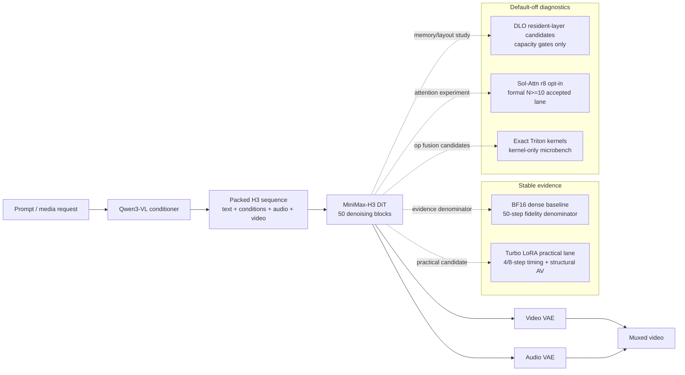

# MiniMax-H3 on A6000 — Argus desktop release tree

> **中文定位**：这是 Argus-AiTeam 为 **单卡 NVIDIA RTX A6000 48 GB（SM86）桌面/工作站**整理的 MiniMax-H3 代码发布树。它只包含源码、补丁、测试、Schema、报告和小型证据 JSON；不包含模型权重、适配器、生成视频、Docker 层、缓存、凭据或 vendored 上游源码。
>
> **English positioning**: this is the Argus-AiTeam maintained **code-only** MiniMax-H3 desktop/A6000 release tree. It documents a conservative BF16 fidelity baseline, practical Turbo candidates, DLO capacity evidence, and default-off Sol/attention diagnostics without bundling private runtime artifacts or weights.

MiniMax-H3 is an omni-modal diffusion pipeline for synchronized video + audio generation. This export is meant to be auditable first and runnable only after a private operator supplies licensed model access, local storage, and GPU approval.

## Quick start / 快速开始

From the export root, these commands are CPU-only and do not load models, start containers, touch GPUs, download files, publish, or call Git:

```bash
bash scripts/a6000_one_command.sh --dry-run
python3 tools/publication_audit.py --root . --max-bytes 1000000 --prohibited-terms-file <local-file-not-committed>
PYTHONPATH=code:ports/minimax_h3_a6000/src python3 -m pytest -q tests/test_github_release_tree_builder.py tests/test_minimax_h3_a6000_performance_report.py
```

The dry run prints the intended preflight/model-prepare/deploy/run/verify stages. A gated non-dry local lifecycle verifier is included for private clean-room checks: it inspects an existing local FL2VA model directory and locked runtime image metadata, runs the checked-in CPU verifier fixture, and audits the sanitized export root. It still does **not** download, start Docker containers, load weights, run GPU inference, generate media, publish, or claim speed/quality.

Current delivery-gate evidence is CPU/static and packaging-only except for already-written GPU evidence that is only read, not rerun: the checked-in reports record CPU/static tests, fixture verification, Turbo dry-run planning, strict aggregation, sanitized export build, publication audit with 0 issues, a terminal Sol-Attn r8 N=3 matched-workload route gate, and a terminal formal Sol-Attn N>=10 matched-workload acceptance. Independent Reviewer certification is still required for the latest formal-N10 sync before any private-main update. These gates do not certify BF16 fidelity for Sol-Attn, Turbo semantic quality, quality equivalence, human listening, public release, or tag creation.

## Hardware and asset requirements / 硬件与资产要求

| Requirement | Current release boundary |
|---|---|
| GPU | Single RTX A6000 48 GB, compute capability 8.6, verified internally as the target class. |
| Host memory | Baseline evidence observed up to about 205 GiB host memory; plan for a high-memory workstation. |
| Model assets | First full MiniMax-H3 preparation is about **144 GB** of licensed weights; weights are never included here. |
| Runtime | Locked runtime metadata is included under `runtime/single_a6000_bf16/`; vendored runtime source and Docker layers are intentionally excluded. |
| Network/credentials | Required only for a later private model/runtime preparation; no credentials belong in this tree. |

## Architecture and DLO map / 架构与 DLO 示意



DLO means resident-layer placement/continuation tuning. The current DLO evidence is a capacity gate, not a formal N10 performance result.

## Evidence-backed 1344x768 status / 证据支持的 1344x768 状态

All rows are read from checked-in reports/evidence for the same 1344x768, 5.166667 s, 124-frame, 24 FPS workload unless marked as diagnostic. Do **not** compare rows across lanes as if they were one benchmark leaderboard.

| Lane / item | Evidence status | Timing | Quality / structure | Release meaning |
|---|---|---:|---|---|
| BF16 dense baseline, 50 steps | certified internal same-physical-device A6000 baseline | warm N10 median **1792.2021025 s** | structural AV pass 13/13 | Fidelity denominator only; not an optimized result. |
| Turbo LoRA, 8 steps | practical paired N10 | median **290.9976015 s**; **6.158820874x** vs BF16 warm median | structural AV pass; semantic quality and human listening pending | Current practical default candidate, not BF16-exact. |
| Turbo LoRA, 4 steps | practical paired N10 | median **149.6191865 s**; **11.978424321x** vs BF16 warm median | structural AV pass; stronger quality-risk boundary | Ultra-fast experimental option, not fidelity evidence. |
| DLO resident layers 13, 5-step capacity gate | present capacity gate | dense 188.098444 s → candidate 186.773476 s | hash match true | Capacity/placement signal only; formal DLO N10 pending. |
| Sol-Attn r8 opt-in, 5-step diagnostic + terminal N=3 route gate + formal N>=10 matched gate | sparse runtime candidate pass; N=3 route decision `proceed_to_formal_n10_candidate`; formal classification `accepted_formal_n10_same_gpu_sol_attn_speed_candidate` | 5-step diagnostic dense **186.498762 s**, opt-in **158.923988 s**; N=3 route-gate median HTTP-time improvement **14.782455716%**; formal N=10 median HTTP-time improvement **15.203295894%** over a >3% threshold | structural AV pass; formal pairs 10/10; every opt-in pair has `sparse_candidate_calls=192`, `sparse_calls=192`, `fallback_calls=0`, density/materialization telemetry, HTTP 200, and resource envelope within thresholds | Accepted only for the formal matched 5-step Sol-Attn opt-in lane. This is **not BF16 fidelity, release approval, Turbo/DLO/DMD evidence, human listening, or semantic quality certification**. |

## Stable vs experimental / 稳定与实验边界

- **Stable / 稳定**: code-only export builder, publication audit, BF16 baseline report, locked runtime metadata, gated local lifecycle verifier, dry-run workflow, and CPU/static tests.
- **Practical but not fidelity / 实用但非保真**: Turbo LoRA 8-step and 4-step timing. These outputs passed structural AV checks, but semantic/video/audio quality still needs separate review before product claims.
- **Diagnostic/formal lane separated / 诊断与正式通道分离**: exact Triton op kernels and DLO capacity gates remain diagnostic; Sol-Attn r8 sparse-execution metadata plumbing plus N=3 route gate led to a separate formal N>=10 matched-workload acceptance only inside the opt-in 5-step Sol-Attn lane. This still is not BF16 fidelity or release approval.
- **Blocked / 阻塞**: DMD/DMD2 remains research-only because there is no first-source H3 recipe/checkpoint basis in this tree.

## Quality limits / 质量限制

Structural AV validation means the file decodes with expected video/audio properties. It is not equivalent to semantic quality, prompt faithfulness, or human auditory approval. Turbo and diagnostic lanes must never be relabeled as BF16-exact fidelity evidence. The Sol-Attn r8 formal N>=10 acceptance is limited to the matched 5-step opt-in lane and must not be reported as BF16 fidelity, release readiness, human-auditory/semantic quality certification, or Turbo/DLO/DMD evidence.

## Reports and evidence links / 报告与证据链接

- `technical_report/minimax_h3_a6000_performance.md` — CPU-only evidence reader with lane boundaries and pending/blocker status.
- `technical_report/final_technical_report.md` — high-level accepted/rejected/blocked summary.
- `technical_report/evidence/minimax_h3_desktop/baseline_a6000/baseline_certification.json` — BF16 baseline denominator.
- `technical_report/evidence/minimax_h3_desktop/dlo_autotune/runs/a6000_dlo_candidate_50_rl16_20260810T141257Z/candidate50_summary.json` — DLO candidate-50 artifact.
- `technical_report/evidence/minimax_h3_desktop/delivery/argus_ir04_delivery_summary.json` — delivery aggregation.
- `technical_report/evidence/minimax_h3_desktop/sol_engine_port/sol_attn_h3_matched_retest_r8_n3_20260812T013544Z/decision.json` — terminal N=3 Sol-Attn route decision.
- `technical_report/evidence/minimax_h3_desktop/sol_engine_port/sol_attn_h3_formal_n10_r8_n10_20260812T031757Z/formal_n10_decision.json` — terminal formal N>=10 matched-workload Sol-Attn opt-in acceptance.
- `ports/minimax_h3_a6000/README.md` — default-off exact-kernel and Sol-Attn port details.

Raw videos, model weights, caches, Docker layers, and private run directories are intentionally outside the release manifest.

## Troubleshooting / 常见问题

| Symptom | Likely cause | Safe next step |
|---|---|---|
| Publication audit flags a private path or prohibited term | A copied text file contains local machine detail | Fix the source text or pass a local prohibited-terms file; rebuild the export. |
| Non-dry lifecycle refuses to run | The explicit `ARGUS_ALLOW_MINIMAX_H3_RUN=1`, authorization id, clean `--work-dir`, local model dir, or locked Docker image is missing | Fix the declared local resource or run `--dry-run`; do not download or mutate weights implicitly. |
| Sol-Attn appears faster in r8 5-step, N=3 route-gate, or formal N>=10 timing | Sparse path evidence exists, and the formal N>=10 gate is accepted only in the matched 5-step opt-in lane | Report only that bounded formal-lane result with its evidence; do not claim BF16 fidelity, release readiness, semantic/human quality, or quality equivalence. |
| Turbo output is fast but visually questionable | Structural AV is not semantic quality | Run human/semantic review before user-facing quality claims. |
| Model files are missing | Weights are excluded by design | Obtain official MiniMax-H3 access and prepare assets only in a private authorized environment. |

## External supervised commands for later private operators

These are documentation-only runbook commands. They are **not** run by the release builder and require a private workstation with approved GPU/runtime/model access:

```bash
# Rebuild the CPU-only performance report from already-written evidence.
python3 tools/minimax_h3_a6000_performance_report.py --evidence-root technical_report/evidence/minimax_h3_desktop --out technical_report/minimax_h3_a6000_performance.md

# Recheck the static release tree before any publication decision.
python3 tools/build_github_release_tree.py --source-root . --manifest release/github_release_manifest.json --dest <export-root> --force --json
python3 tools/publication_audit.py --root <export-root> --max-bytes 1000000 --prohibited-terms-file <local-file-not-committed>

# Optional private GPU2 diagnostic retry; keep Sol-Attn default-off unless the runbook explicitly opts in.
PYTHONPATH=ports/minimax_h3_a6000/src python3 ports/minimax_h3_a6000/gpu_exact_kernel_test.py --device cuda:0 --output <private-evidence-root>/h3_exact_correctness.json
PYTHONPATH=ports/minimax_h3_a6000/src python3 ports/minimax_h3_a6000/gpu_sol_attn_sm86_harness.py --device cuda:0 --mode both --output <private-evidence-root>/h3_sol_attn_sm86.json
```

## Roadmap / 路线图

1. Keep the release tree audit-clean and code-only.
2. Finish quality review for practical Turbo lanes before product language changes.
3. Promote DLO only after a formal same-device N10 timing result exists.
4. Keep the Sol-Attn formal N>=10 acceptance confined to its matched 5-step opt-in lane; the independent Reviewer has accepted this bounded formal-lane evidence, private-main sync is allowed only after a fresh zero-issue export/publication audit, and it must not become BF16 fidelity, public release, or human-quality language.
5. Revisit DMD/DMD2 only if a real H3 first-source recipe/checkpoint appears.

## Attribution / 致谢

See `NOTICE`, `LICENSE`, and `ports/minimax_h3_a6000/NOTICE`. NVLabs/Sol-Engine attribution is preserved for Sol-Engine-derived design/kernel-candidate work; MiniMax, vLLM-Omni, Hugging Face ecosystem packages, PyTorch, Triton, and other upstream projects retain their own licenses and authorship.
