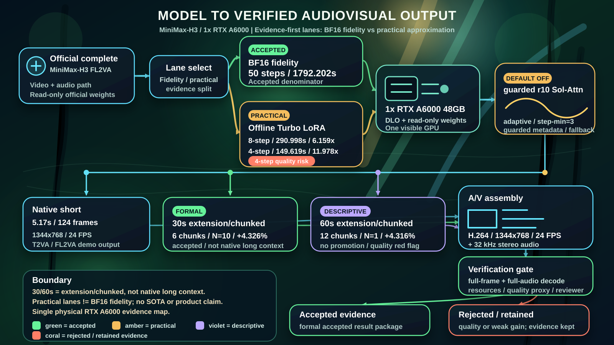
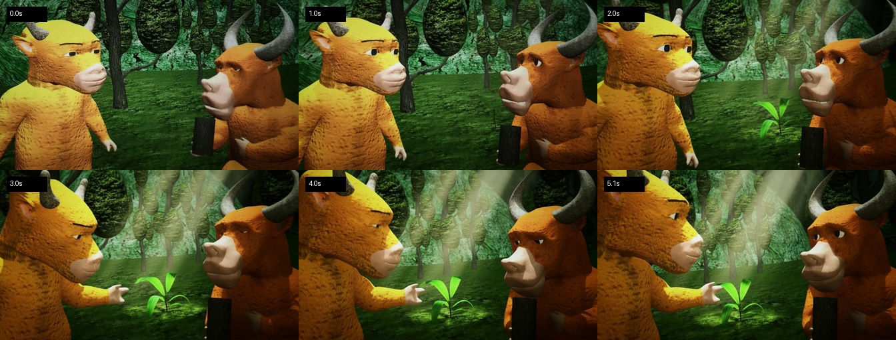

<h1 align="center">MiniMax-H3 on a Single RTX A6000</h1>

<p align="center">
  <strong>Full FL2VA on one 48 GB A6000, generating 1344×768 video with synchronized stereo audio</strong><br>
  <sub>6.159× practical default · 11.978× fastest measured lane · 30s formal +4.326% · 60s E2E demonstrated</sub>
</p>

<p align="center">
  <a href="CURRENT_WORK.md"><strong>Current Work</strong></a> ·
  <a href="RESEARCH_DASHBOARD.md"><strong>Live Dashboard</strong></a> ·
  <a href="benchmark_contract/v1/README.md"><strong>Benchmark Contract</strong></a> ·
  <a href="README.md">中文</a> ·
  <a href="#generated-result">Watch the result</a> ·
  <a href="#quick-start">Quick start</a> ·
  <a href="#results-at-a-glance">Metrics</a> ·
  <a href="technical_report/minimax_h3_a6000_performance.md">Full report</a>
</p>

<p align="center">
  
  
  
  
  
  
  
</p>

> [!IMPORTANT]
> **Strongest accepted long-video result:** on one RTX A6000, the matched formal N=10 30-second final-AV `r10_adaptive_tau1_5_step3_diag` lane reached a **1333.575-second** warm E2E median versus **1394.006 seconds** for retained r9, a **4.326% improvement**. The full 60-second path also ran end to end: r10 N=1 took **2682.008 seconds** versus **2802.991 seconds** for r9. That **4.316% is a single-sample research signal**, not a formal speedup, because the automatic quality gate blocked promotion.

This project runs the complete MiniMax-H3 FL2VA pipeline on **one real NVIDIA RTX A6000 48 GB (SM86)**. It does not substitute a smaller model or report a multi-GPU server as a desktop result. Every promoted number uses a frozen control on the same physical GPU. Candidates that miss performance or quality gates remain visibly rejected instead of being marketed as wins.

<p align="center">
  <a href="examples/a6000-turbo-8step-niulai-inspired/niulai-inspired-forest-awakening-turbo-8step.mp4">
    
  </a><br>
  <strong>Latest FL2VA hero showcase · Forest Awakening</strong><br>
  <sub>Unofficial original shot generated from the operator-supplied reference · click to play</sub>
</p>

## Results at a glance

| Capability | Measured result | Interpretation |
|---|---:|---|
| BF16 fidelity short clip | **1792.202 s**, warm N=10 median | Same-card fidelity denominator |
| Turbo 8-step short clip | **290.998 s, 6.159×** | Recommended practical default |
| Turbo 4-step short clip | **149.619 s, 11.978×** | Faster, with a retained visual failure case |
| Sol-Attn r8 short clip | **15.203%** median HTTP-time improvement, 10/10 pairs | Real sparse calls, not a toy benchmark |
| 30-second r10 final AV | **1333.575 vs 1394.006 s, +4.326%** | Independently reviewed formal N=10 result |
| 60-second r10 final AV | **2682.008 vs 2802.991 s, N=1 +4.316% signal** | Complete 1440-frame/stereo demonstration; descriptive only |
| Latest VAE cap=4 candidate | **1302.506 vs 1331.377 s, N=1 +2.168% signal** | VAE was ~14.1% faster, but quality failed; rejected |

> **Scope:** 30/60-second outputs use an extension/chunked workflow, not native long context. Turbo, Sol-Attn, and VAE batching are `practical_disclosed_approx`, not BF16 fidelity. N=1 deltas are route-gating signals, never formal speedup claims.

## From model to final audiovisual output

<p align="center">
  <a href="docs/assets/minimax-h3-a6000-pipeline.svg">
    
  </a>
</p>

<p align="center">
  <sub>Complete FL2VA → fidelity/practical split → one A6000 + DLO → guarded r10 Sol-Attn → 5.17s / 30s / 60s outputs → A/V assembly and verification</sub>
</p>

> Green denotes formally accepted evidence, amber a practical lane, violet descriptive/no-promotion evidence, and coral a rejected route retained for auditability. The 30/60-second lanes remain extension/chunked, never native long context.

---

## Generated result

### Hero showcase: from a reference image to an original moving shot

<a href="examples/a6000-turbo-8step-niulai-inspired/niulai-inspired-forest-awakening-turbo-8step.mp4">
  
</a>

<p align="center">
  <strong>Forest Awakening / 雨后新生</strong><br>
  <sub>Click the hero image to play the complete 1344×768, 24 FPS, 32 kHz stereo video</sub>
</p>

<a href="examples/a6000-turbo-8step-niulai-inspired/niulai-inspired-forest-awakening-turbo-8step.mp4">
  
</a>

- **[Watch or download the complete FL2VA video](examples/a6000-turbo-8step-niulai-inspired/niulai-inspired-forest-awakening-turbo-8step.mp4)**
- [Full prompt](examples/a6000-turbo-8step-niulai-inspired/prompt.txt) · [generation, selection, and validation metadata](examples/a6000-turbo-8step-niulai-inspired/metadata.json)
- Input: an operator-supplied local image associated with *Niu Lai*; its SHA256 is recorded, but the source image is **not redistributed**
- Selection: all three 8-step seeds completed before seed 42 was selected; this is not merely the first random output
- Measured request time: **305.386 seconds (about 5 min 5 s)**
- Measured resources: **27,410 MiB** peak GPU memory, **301.16 W** peak power, **79°C** peak temperature
- Validation: **124/124 frames**, 32 kHz stereo, 166,912 samples/channel, and **zero** transitions below the strict `<0.05` frozen-frame threshold
- Visual review: both bovine identities, colors, and horn silhouettes remain stable; the seedling, gesture, and progressive volumetric light form a readable one-shot story

> [!NOTE]
> This is an **unofficial original demonstration** generated from the operator-supplied reference. It is not a clip from, official recreation of, or collaboration with the film *Niu Lai*. MiniMax-H3 generated the new camera motion, lighting, seedling narrative, and ambience. Automated checks certify complete video and active stereo, not operator subjective listening.

### Text-only showcase: orbital shipyard

This second clip was generated specifically for this repository on one RTX A6000. It is not copied from the Mac project or another benchmark.

<a href="examples/a6000-turbo-8step-sci-fi/orbital-shipyard-turbo-8step.mp4">
  
</a>

- **[Watch or download the 1344×768 science-fiction clip](examples/a6000-turbo-8step-sci-fi/orbital-shipyard-turbo-8step.mp4)**
- [Full prompt](examples/a6000-turbo-8step-sci-fi/prompt.txt) · [run and validation metadata](examples/a6000-turbo-8step-sci-fi/metadata.json)
- Configuration: one RTX A6000, Turbo 8-step, seed 42, 124 frames, 24 FPS, 5.1667 seconds
- Measured request time: **291.627 seconds (about 4 min 52 s)**
- Output: H.264 video with AAC 32 kHz stereo audio
- Video SHA256: `454fceb57b1daf60dc5db1ade9aae295cee2ecd16fd90ab2c2f16c7b626db69a`

Prompt excerpt:

```text
A cinematic wide shot inside a colossal orbital shipyard above a luminous blue planet.
A sleek silver exploration starship slowly launches from a glowing circular docking ring
as coherent blue plasma thrusters ignite ...
```

The artifact passed full 124-frame decoding, stereo-audio decoding, active-audio checks, a no-frozen-transition proxy, and a six-frame visual review. Turbo is a disclosed practical approximation, not a BF16-exact claim.

---

## Measured A6000 performance

Frozen workload: **full FL2VA, 1344×768, 124 frames, 24 FPS, 5.166667 seconds, 32 kHz stereo audio**. Speedups use the warm BF16 N=10 median from the same physical A6000.

| Lane | Steps | Formal N | Median | vs. BF16 | Positioning |
|---|---:|---:|---:|---:|---|
| BF16 dense baseline | 50 | 10 | **1792.202 s** | 1.000× | fidelity denominator |
| **Turbo 8-step** | 8 | 10 | **290.998 s** | **6.159×** | recommended practical default |
| Turbo 4-step | 4 | 10 | **149.619 s** | **11.978×** | ultra-fast experimental option with more quality risk |

### Measured resources

| Lane | Peak GPU memory | Peak host memory | Peak power | Peak temperature |
|---|---:|---:|---:|---:|
| BF16 baseline | 26,836 MiB | 204.84 GiB | 302.23 W | 84°C |
| Turbo formal timing | 26,836 MiB | 195.16 GiB | 301.08 W | 83°C |
| README science-fiction demo session | 26,664 MiB | 175.95 GiB | 301.09 W | 83°C |
| Forest Awakening three-candidate FL2VA session | 27,410 MiB | 185.95 GiB | 301.16 W | 79°C |

The 8-step schedule is the practical recommendation: it delivered a stable 6.159× N=10 result and passed 12/12 visual cases in the 24-case suite. The 4-step schedule reached 11.978× but passed 11/12 visual cases; a known teapot sample had visibly malformed geometry. The operator completed human playback/listening review and gave an overall positive acceptance, while the known 4-step failure remains disclosed. The public release includes the [review matrix and six aggregate contact sheets](technical_report/evidence/minimax_h3_desktop/turbo_merged/quality_suite_runs/gpu3_turbo_quality_20260810T005611Z/human_review.md) supporting those visual counts; the compact release tree intentionally omits the full set of 24 raw quality-suite MP4s.

### 30-second final-AV extension/chunked formal r10

This is a practical approximate long-video lane on one A6000. It is not cross-compared with the BF16 short-clip denominator.

| Lane | Generation mode | Formal N | Warm E2E median | Reference | Claim boundary |
|---|---|---:|---:|---:|---|
| `r10_adaptive_tau1_5_step3_diag` | six-chunk `extension` / chunked final AV | 10 | **1333.575 s** | retained `r9_current_sol_attn` **1394.006 s** | **4.326%** median warm-E2E improvement; complete 720-frame / 960,000-sample-per-channel final AV accounting |

The r10 result only states that guarded adaptive step-min=3 Sol-Attn improved the matched formal N=10 30-second final-AV extension/chunked practical lane versus retained r9. It explicitly excludes native long context, BF16 fidelity, human semantic/audio quality, product readiness, public comparison, and SOTA.

### Latest research frontier: measurable signals, strict rejection

| New route | Reference → Candidate | Measured signal | Decision |
|---|---:|---:|---|
| 60s r10 guarded adaptive | 2802.991 → **2682.008 s** | N=1 **4.316%** | Complete 1440-frame / 1,920,000-sample-per-channel output; frozen-transition proxy flag, descriptive/no-promotion |
| VAE full spatial tile batching | 1335.018 → **1299.728 s** | E2E **2.643%**; VAE 202.720 → **167.802 s** | Initial N=1 route gate passed; still a default-off practical approximate candidate, not formal evidence |
| VAE bounded tile batch cap=4 | 1331.377 → **1302.506 s** | E2E **2.168%**; VAE 202.424 → **173.886 s** | Subject/background proxies regressed by about 10%; rejected, no N=3 |
| DLO async sync-prefetch | 1335.021 → **1334.684 s** | E2E **0.025%** | Group-first host enqueue fell from 297.799 s to 0.0088 s, but it was not critical-path gain; rejected |

- [60-second N=1 decision and scope](technical_report/evidence/minimax_h3_desktop/long_video/final-av-60s-r9-current-vs-r10-step3-sol-attn-n1-20260816T164226Z/RUN_REPORT.md)
- [VAE full spatial batching N=1](technical_report/evidence/minimax_h3_desktop/long_video/final-av-30s-r10-vae-spatial-tile-batching-n1-lease-20260817T033717Z/RUN_REPORT.md)
- [VAE bounded cap=4 terminal rejection](technical_report/evidence/minimax_h3_desktop/long_video/final-av-30s-r10-vae-tile-batch-cap-4-n1-20260817T110844Z/RUN_REPORT.md)

> **Report freshness:** the consolidated performance report is an accepted-results snapshot from 2026-08-16. The 2026-08-17 frontier rows above are governed by the directly linked per-run `RUN_REPORT.md` / decision packets and have not been repackaged as new accepted aggregate results.

See [`technical_report/minimax_h3_a6000_performance.md`](technical_report/minimax_h3_a6000_performance.md) for accepted statistics, variability, quality scope, and evidence paths.

---

## What is complete

- [x] Complete MiniMax-H3 FL2VA assets (about 134.16 GiB)
- [x] One RTX A6000 48 GB exposed to each model process
- [x] 1344×768, 124 frames, 24 FPS, stereo audiovisual output
- [x] Warm N=10 BF16 dense baseline
- [x] Same-device paired N=10 Turbo 4-step and 8-step measurements
- [x] 24-case Turbo suite: 3 prompts × 4 seeds × 2 schedules
- [x] Directly viewable A6000 science-fiction T2VA and Forest Awakening reference-image FL2VA demos
- [x] DLO capacity and 50-step candidate analysis
- [x] SM86 exact-kernel candidates with drift checks
- [x] Sol-Attn r8 real H3 metadata plumbing, sparse execution, N=3 route gate, and formal N=10
- [x] 30-second final-AV extension/chunked r10 formal N=10 timing/structural result (bounded; not native/BF16/human-quality/product evidence)
- [x] Complete 60-second final-AV extension/chunked N=1 output: 1440 frames and 32 kHz stereo; descriptive acceptance, no formal speedup claim
- [x] Fail-closed VAE spatial/bounded tile batching, CUDA Graph, DLO async prefetch, Cache-DiT, and regional-compile experiments, including negative evidence
- [x] CPU/static tests, sanitized export, publication audit, and compact evidence reports

---

## Quick start

“Quick” means configuring the repository and starting the workflow. It excludes the roughly 134 GiB model download, the roughly 20 GB runtime build, and inference time.

### Hardware and system

Measured environment:

- Ubuntu 24.04 x86_64
- NVIDIA RTX A6000 48 GB, SM86
- NVIDIA driver 580.159.03
- Docker with the NVIDIA Container Toolkit
- a high-memory host (the measured BF16 peak was about 205 GiB)

Recommended capacity:

- one RTX A6000 48 GB;
- at least **256 GiB host RAM**;
- at least **230 GiB free disk** for official FL2VA assets, the adapter, the independent merged transformer, the image, and caches;
- Git, Docker, NVIDIA Container Toolkit, Python 3, and the Hugging Face CLI.

### 1. Clone and authenticate

```bash
git clone https://github.com/Argus-AiTeam/minimax-h3-desktop.git
cd minimax-h3-desktop

python3 -m venv .venv
source .venv/bin/activate
pip install 'huggingface_hub[cli]==0.34.4'
hf auth login
```

Before downloading, read and accept the [MiniMax-H3 License](https://huggingface.co/MiniMaxAI/MiniMax-H3/blob/main/LICENSE), including its territory and use restrictions. Model assets are not covered by this repository's Apache-2.0 code license.

### 2. Preview every action

```bash
make dry-run
```

Dry-run performs no download, Docker build/run, GPU access, model loading, or generation.

### 3. Build the pinned runtime

```bash
make runtime
```

This pins vLLM-Omni commit `8e2e9b6b53e86e6a479ed2c0a53782f655f60e04` and builds its upstream CUDA Dockerfile. The build is large and can take substantial time.

### 4. Download and prepare the models

Choose an idle GPU for the offline merge:

```bash
I_ACCEPT_MINIMAX_H3_LICENSE=YES \
GPU_INDEX=0 \
make models
```

The script downloads pinned `MiniMaxAI/MiniMax-H3` FL2VA assets and the pinned Larry Turbo EMA adapter, validates the adapter hash, and creates an independent FP32-accumulate/BF16-cast merged transformer. It verifies 13 transformer shards and 259 LoRA pairs and never overwrites the official base weights.

For already-downloaded assets:

```bash
I_ACCEPT_MINIMAX_H3_LICENSE=YES SKIP_DOWNLOAD=1 GPU_INDEX=0 make models
```

### 5. Generate an MP4

```bash
I_ACCEPT_MINIMAX_H3_LICENSE=YES \
GPU_INDEX=0 \
SEEDS=42 \
STEPS=8 \
OUTPUT_DIR="$PWD/out/my-first-h3-video" \
make demo
```

Use your own prompt:

```bash
printf '%s\n' 'A cinematic robot walking through a neon city in the rain, smooth camera motion, synchronized city ambience, no text, no watermark' > my-prompt.txt

I_ACCEPT_MINIMAX_H3_LICENSE=YES \
GPU_INDEX=0 \
PROMPT_FILE="$PWD/my-prompt.txt" \
OUTPUT_DIR="$PWD/out/neon-robot" \
bash scripts/run_turbo_demo.sh
```

Enable FL2VA with a local first-frame reference (the source image is never copied into the model directory):

```bash
I_ACCEPT_MINIMAX_H3_LICENSE=YES \
GPU_INDEX=0 \
INPUT_REFERENCE="$PWD/my-reference.png" \
PROMPT_FILE="$PWD/my-prompt.txt" \
OUTPUT_DIR="$PWD/out/reference-animation" \
bash scripts/run_turbo_demo.sh
```

The runner refuses a busy GPU, exposes exactly one card, mounts weights read-only, starts the API in a network-disabled container, creates the MP4, validates video and 32 kHz stereo audio, records timing/hash/resource metadata, and removes the temporary container.

---

## Sol-Attn: verified sparse execution

The repository preserves unsuccessful iterations rather than hiding them:

- r6: all 208 calls failed closed because of unsupported contiguity;
- r7: packed-video metadata did not reach the attention backend, so `sparse_calls=0`;
- r8: after repairing H3 metadata plumbing, a real 5-step run recorded `sparse_candidate_calls=192`, `sparse_calls=192`, and `fallback_calls=0`.

Formal matched N=10:

| Item | Result |
|---|---:|
| Completed pairs | 10/10 |
| HTTP and structural AV | all passed |
| Median HTTP-time improvement | **15.203%** |
| Promotion threshold | 3.0% |
| Sparse calls per pair | 192 |
| Fallback calls | 0 |

This result is limited to the **5-step Sol-Attn opt-in matched lane**. It is not a 50-step BF16 fidelity speedup and not a Turbo, DLO, or semantic-quality-equivalence claim. The implementation defaults off and fails closed to dense when metadata is unsuitable.

The 30-second final-AV extension/chunked r10 formal N=10 lane further retains default-off guarded adaptive Sol-Attn step-min=3: warm E2E median **1333.575 s** vs retained r9 **1394.006 s**, median improvement **4.326%**, with 10/10 pairs complete. This applies only to the matched 30-second extension/chunked practical lane and is not native long context, BF16 fidelity, human semantic/audio quality, product readiness, public-comparison, or SOTA evidence.

The later `MINIMAX_H3_A6000_SOL_ATTN_PAIR_VALUE_HALVES` path remains default-off and is retained only by a captured-metadata, non-Docker, model-free SM86 replay: candidate total median **144.652 ms** vs current prefix-skip **175.216 ms**, forward pointer subphase **129.850 ms** vs **158.161 ms**, `max_abs_valid=0`, and zero unintended materialized copy events/bytes in the replay lanes. This shows a captured-metadata kernel mechanism, not an H3 end-to-end, long-video, BF16-fidelity, normal-PC, product-speedup, public-comparison, or SOTA result.

---

## Rejected or paused routes

| Route | Decision | Reason |
|---|---|---|
| DLO RL16 50-step | no formal N=10 | 0.456% candidate improvement was below the 0.837% baseline CV |
| RoPE/all-exact | rejected | audiovisual output drift |
| SwiGLU end-to-end | not deployed | no retained E2E benefit |
| Toy Sol-Attn | rejected | sparse microbenchmark was slower than dense |
| DMD/DMD2 | research-only blocked | no legal, first-source, reproducible H3 recipe/checkpoint |
| r11/r12 more aggressive adaptive routing | rejected | N=1 signals were only 1.135% / 0.358%, and objective quality proxies failed |
| Cache-DiT high/high_warmup2 | rejected | no actual cache reuse; warm E2E had no gain or regressed by 0.031% |
| VAE CUDA Graph | rejected | bit-exact, but 32.865 → 32.945 s was slightly slower |
| VAE bounded tile batch cap=4 | rejected | 2.168% E2E signal, but subject/background proxies missed the 5% non-inferiority gate |
| DLO async sync-prefetch | rejected | major telemetry change, but only 0.025% E2E gain versus the 1% promotion threshold |
| Regional `torch.compile` | no-go | graph breaks/recompiles led to timeout and no candidate media; source-grounded signal was also below threshold |

Negative evidence remains visible so cherry-picked runs, post-hoc thresholds, and kernel/telemetry microbenchmarks cannot be mistaken for full-model speedups.

---

## Repository map

```text
examples/                         viewable A6000-generated media
scripts/build_runtime.sh          pinned vLLM-Omni CUDA image build
scripts/prepare_models.sh         licensed download, validation, offline Turbo merge
scripts/run_turbo_demo.sh         real single-A6000 generation entry point
ports/minimax_h3_a6000/           SM86 kernels, Sol-Attn, patch, and tests
runtime/single_a6000_bf16/        pinned version/digest/dependency metadata
technical_report/                 performance, quality, resource, and evidence reports
schemas/                          run-record schemas
Makefile                          dry-run/runtime/models/demo/test/audit entry points
```

Weights, adapters, Docker layers, caches, credentials, and private raw logs are never committed.

### Test and audit

```bash
make test
make audit
```

---

## Scope

- The certified target is **one RTX A6000 48 GB**.
- Although the test host contained four A6000s, each formal model process saw one GPU; no multi-GPU result is reported as single-card.
- These numbers are not RTX 5090, DGX Spark, A100, H100, or 8×GB200 results.
- Turbo is a practical approximation. The BF16 baseline is the fidelity denominator.
- Runtime varies with prompts, drivers, thermals, storage, host RAM, and background load.

For Apple Silicon, see the sibling project [`Argus-AiTeam/minimax-h3-mac`](https://github.com/Argus-AiTeam/minimax-h3-mac). The two repositories share an evidence-first philosophy but use independent implementations and independent performance data.

---

## Projects and acknowledgements

- [MiniMax-H3](https://huggingface.co/MiniMaxAI/MiniMax-H3) — architecture and official weights
- [vLLM-Omni](https://github.com/vllm-project/vllm-omni) — CUDA serving foundation
- [Larry MiniMax-H3 Turbo LoRA](https://huggingface.co/larryvrh/MiniMax-H3-Turbo-Lora) — practical few-step adapter
- [NVLabs/Sana](https://github.com/NVlabs/Sana) — upstream Sol-Engine research direction
- PyTorch, Triton, Hugging Face, and the broader open-source community

See [`NOTICE`](NOTICE), [`ports/minimax_h3_a6000/NOTICE`](ports/minimax_h3_a6000/NOTICE), and [`ports/minimax_h3_a6000/UPSTREAM.md`](ports/minimax_h3_a6000/UPSTREAM.md).

## License

Original code in this repository is released under [Apache License 2.0](LICENSE). MiniMax-H3 weights, the Turbo adapter, generated content, and third-party dependencies remain subject to their respective licenses and usage terms; this repository does not relicense those assets.

<p align="center"><strong>Full MiniMax-H3 can now generate 768p video with synchronized audio on one RTX A6000.</strong></p>
