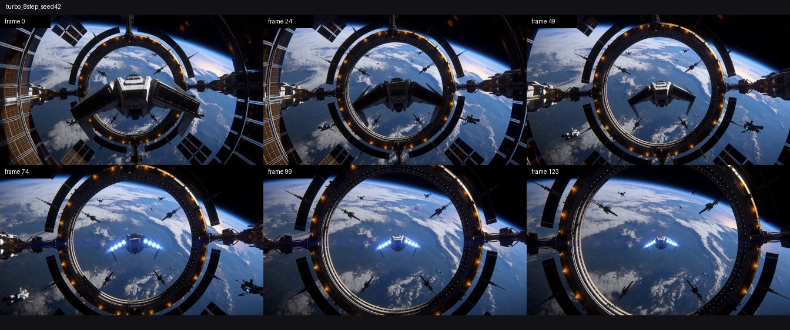

<h1 align="center">MiniMax-H3 on a Single RTX A6000</h1>

<p align="center">
  <strong>Full FL2VA · 1344×768 · synchronized video and stereo audio · up to 11.98× Turbo · formal Sol-Attn N=10</strong>
</p>

<p align="center">
  <a href="CURRENT_WORK.md"><strong>Current Work / 当前工作</strong></a> ·
  <a href="benchmark_contract/v1/README.md"><strong>Benchmark Contract v1</strong></a> ·
  <a href="README.md">中文</a> ·
  <a href="#generated-result">Generated result</a> ·
  <a href="#quick-start">Quick start</a> ·
  <a href="#measured-a6000-performance">Performance</a> ·
  <a href="technical_report/minimax_h3_a6000_performance.md">Full report</a>
</p>

<p align="center">
  
  
  
  
</p>

> **Long-video work:** the current focus is 720p-class 30/60-second audiovisual production on one RTX A6000. See [`CURRENT_WORK.md`](CURRENT_WORK.md) for accepted evidence, negative results, active hypotheses, and the next experiment. Short-clip baselines are not presented as long-video results. The canonical workloads, timing hierarchy, quality gates, and fail-closed claim validator are in [`benchmark_contract/v1/README.md`](benchmark_contract/v1/README.md). The pinned open-source path supports only 4–15-second native output, so both 30/60-second manifests remain unmeasured `extension` lanes.
>
> **Continuous optimization direction:** the project continues MiniMax-H3 through open-ended evidence cycles: first a reproducible 30-second and then a 60-second 720p-class production path, with real-chain work on Sol-Engine, Sol-Attn, Q/K/V packing, copy/synchronization, VAE, audio, and container/encoding bottlenecks. Each cycle tracks primary papers, official repository revisions, and licenses, then keeps or rejects frontier ideas only through same-GPU, matched-workload, matched-quality end-to-end evidence. The ambition is to advance toward world-leading performance with reproducible evidence; the repository will not claim “world best” or SOTA without a valid public comparison.
>
> **Ultimate deployment goal:** move complete MiniMax-H3 audiovisual generation from a data-center multi-GPU setting to a normal single-machine computer with an auditable one-command prepare/run/verify workflow. The A6000 is the current fixed single-GPU engineering proxy for reducing VRAM, host RAM, startup time, wall-clock seconds per generated second, power, and deployment complexity. It is still a 48 GB workstation GPU on a high-memory host, so these results do not prove consumer-PC support; lower-memory hardware requires its own real-device baseline and acceptance.

### Continuous quantitative scoreboard

Only accepted, traceable same-GPU short-clip evidence is shown here. The 30/60-second lanes remain unmeasured extensions. Lower wall-clock seconds per generated second is better.

| Lane | Accepted workload | Median | Wall-clock s / generated s | Peak GPU / host memory | Meaning |
|---|---|---:|---:|---:|---|
| BF16 fidelity | 5.1667 s, N=10 | 1792.202 s | 346.878 | 26,836 MiB / 204.84 GiB | Fidelity denominator |
| Turbo 8-step | 5.1667 s, N=10 | 290.998 s | 56.322 | 26,836 MiB / 195.16 GiB | Current practical default |
| Turbo 4-step | 5.1667 s, N=10 | 149.619 s | 28.959 | 26,836 MiB / 195.16 GiB | Faster, with greater quality risk |
| Sol-Attn r8 opt-in | matched 5-step, 10/10 pairs | 15.203% median HTTP improvement | not converted across lanes | 192 sparse calls/pair, 0 fallback | Real sparse-lane promotion only |

### Work in progress

1. Remove the r8/r9 real-chain Q/K/V materialization—about 192 events and 105.34 GB per 5-step run—using layout-aware views/packing and reusable block maps while preserving dense fail-closed behavior.
2. Restore a reproducible runtime/overlay build chain and promote N=1 → N=3 → N≥10 only when structural AV, quality proxies, copy bytes, and same-GPU E2E evidence pass together.
3. Establish the first 30-second 720p-class practical AV production baseline with an explicit native-long-context, chunk/overlap/conditioning, or montage/stitching classification.

### Next

- advance 30 seconds to 60 seconds with long-horizon identity, subject, background, camera, motion, repetition/freezing, seam, audio-continuity, and AV-sync measurements;
- reduce GPU VRAM and host RAM alongside speed through offload/prefetch, VAE tiling/fusion, stable compile/CUDA Graph regions, audio/encoding/I/O, and model lifecycle work;
- create separate real-device feasibility profiles closer to normal computers, measuring minimum VRAM/RAM, cold start, disk, power, and failure boundaries;
- update this scoreboard and [`CURRENT_WORK.md`](CURRENT_WORK.md) for every accepted positive result or reproducible negative result, then commit/push only after tests, independent review, and publication audit, with a safe checkpoint at least every three active hours when changes exist.

This project runs the complete MiniMax-H3 FL2VA pipeline on **one real NVIDIA RTX A6000 48 GB (SM86)**. It does not substitute a smaller model and does not report a multi-GPU server as a desktop result. The repository includes a reproducible BF16 baseline, practical Turbo deployment, default-off Sol-Attn work, build/run scripts, tests, and compact evidence.

---

## Generated result

This clip was generated specifically for this repository on one RTX A6000. It is not copied from the Mac project or another benchmark.

<a href="examples/a6000-turbo-8step-sci-fi/orbital-shipyard-turbo-8step.mp4">
  
</a>

- **[Watch or download the 1344×768 science-fiction clip](examples/a6000-turbo-8step-sci-fi/orbital-shipyard-turbo-8step.mp4)**
- [Full prompt](examples/a6000-turbo-8step-sci-fi/prompt.txt) · [run and validation metadata](examples/a6000-turbo-8step-sci-fi/metadata.json)
- Configuration: one RTX A6000, Turbo 8-step, seed 42, 124 frames, 24 FPS, 5.1667 seconds
- Measured request time: **291.627 seconds (about 4 min 52 s)**
- Output: H.264 video with AAC 32 kHz stereo audio
- Video SHA256: `454fceb57b1daf60dc5db1ade9aae295cee2ecd16fd90ab2c2f16c7b626db69a`

Prompt excerpt:

```text
A cinematic wide shot inside a colossal orbital shipyard above a luminous blue planet.
A sleek silver exploration starship slowly launches from a glowing circular docking ring
as coherent blue plasma thrusters ignite ...
```

The artifact passed full 124-frame decoding, stereo-audio decoding, active-audio checks, a no-frozen-transition proxy, and a six-frame visual review. Turbo is a disclosed practical approximation, not a BF16-exact claim.

---

## Measured A6000 performance

Frozen workload: **full FL2VA, 1344×768, 124 frames, 24 FPS, 5.166667 seconds, 32 kHz stereo audio**. Speedups use the warm BF16 N=10 median from the same physical A6000.

| Lane | Steps | Formal N | Median | vs. BF16 | Positioning |
|---|---:|---:|---:|---:|---|
| BF16 dense baseline | 50 | 10 | **1792.202 s** | 1.000× | fidelity denominator |
| **Turbo 8-step** | 8 | 10 | **290.998 s** | **6.159×** | recommended practical default |
| Turbo 4-step | 4 | 10 | **149.619 s** | **11.978×** | ultra-fast experimental option with more quality risk |

### Measured resources

| Lane | Peak GPU memory | Peak host memory | Peak power | Peak temperature |
|---|---:|---:|---:|---:|
| BF16 baseline | 26,836 MiB | 204.84 GiB | 302.23 W | 84°C |
| Turbo formal timing | 26,836 MiB | 195.16 GiB | 301.08 W | 83°C |
| README science-fiction demo session | 26,664 MiB | 175.95 GiB | 301.09 W | 83°C |

The 8-step schedule is the practical recommendation: it delivered a stable 6.159× N=10 result and passed 12/12 visual cases in the 24-case suite. The 4-step schedule reached 11.978× but passed 11/12 visual cases; a known teapot sample had visibly malformed geometry. The operator completed human playback/listening review and gave an overall positive acceptance, while the known 4-step failure remains disclosed.

See [`technical_report/minimax_h3_a6000_performance.md`](technical_report/minimax_h3_a6000_performance.md) for statistics, variability, quality scope, and evidence paths.

---

## What is complete

- [x] Complete MiniMax-H3 FL2VA assets (about 134.16 GiB)
- [x] One RTX A6000 48 GB exposed to each model process
- [x] 1344×768, 124 frames, 24 FPS, stereo audiovisual output
- [x] Warm N=10 BF16 dense baseline
- [x] Same-device paired N=10 Turbo 4-step and 8-step measurements
- [x] 24-case Turbo suite: 3 prompts × 4 seeds × 2 schedules
- [x] A newly generated, directly viewable A6000 demo
- [x] DLO capacity and 50-step candidate analysis
- [x] SM86 exact-kernel candidates with drift checks
- [x] Sol-Attn r8 real H3 metadata plumbing, sparse execution, N=3 route gate, and formal N=10
- [x] CPU/static tests, sanitized export, publication audit, and compact evidence reports

---

## Quick start

“Quick” means configuring the repository and starting the workflow. It excludes the roughly 134 GiB model download, the roughly 20 GB runtime build, and inference time.

### Hardware and system

Measured environment:

- Ubuntu 24.04 x86_64
- NVIDIA RTX A6000 48 GB, SM86
- NVIDIA driver 580.159.03
- Docker with the NVIDIA Container Toolkit
- a high-memory host (the measured BF16 peak was about 205 GiB)

Recommended capacity:

- one RTX A6000 48 GB;
- at least **256 GiB host RAM**;
- at least **230 GiB free disk** for official FL2VA assets, the adapter, the independent merged transformer, the image, and caches;
- Git, Docker, NVIDIA Container Toolkit, Python 3, and the Hugging Face CLI.

### 1. Clone and authenticate

```bash
git clone https://github.com/Argus-AiTeam/minimax-h3-desktop.git
cd minimax-h3-desktop

python3 -m venv .venv
source .venv/bin/activate
pip install 'huggingface_hub[cli]==0.34.4'
hf auth login
```

Before downloading, read and accept the [MiniMax-H3 License](https://huggingface.co/MiniMaxAI/MiniMax-H3/blob/main/LICENSE), including its territory and use restrictions. Model assets are not covered by this repository's Apache-2.0 code license.

### 2. Preview every action

```bash
make dry-run
```

Dry-run performs no download, Docker build/run, GPU access, model loading, or generation.

### 3. Build the pinned runtime

```bash
make runtime
```

This pins vLLM-Omni commit `8e2e9b6b53e86e6a479ed2c0a53782f655f60e04` and builds its upstream CUDA Dockerfile. The build is large and can take substantial time.

### 4. Download and prepare the models

Choose an idle GPU for the offline merge:

```bash
I_ACCEPT_MINIMAX_H3_LICENSE=YES \
GPU_INDEX=0 \
make models
```

The script downloads pinned `MiniMaxAI/MiniMax-H3` FL2VA assets and the pinned Larry Turbo EMA adapter, validates the adapter hash, and creates an independent FP32-accumulate/BF16-cast merged transformer. It verifies 13 transformer shards and 259 LoRA pairs and never overwrites the official base weights.

For already-downloaded assets:

```bash
I_ACCEPT_MINIMAX_H3_LICENSE=YES SKIP_DOWNLOAD=1 GPU_INDEX=0 make models
```

### 5. Generate an MP4

```bash
I_ACCEPT_MINIMAX_H3_LICENSE=YES \
GPU_INDEX=0 \
SEEDS=42 \
STEPS=8 \
OUTPUT_DIR="$PWD/out/my-first-h3-video" \
make demo
```

Use your own prompt:

```bash
printf '%s\n' 'A cinematic robot walking through a neon city in the rain, smooth camera motion, synchronized city ambience, no text, no watermark' > my-prompt.txt

I_ACCEPT_MINIMAX_H3_LICENSE=YES \
GPU_INDEX=0 \
PROMPT_FILE="$PWD/my-prompt.txt" \
OUTPUT_DIR="$PWD/out/neon-robot" \
bash scripts/run_turbo_demo.sh
```

The runner refuses a busy GPU, exposes exactly one card, mounts weights read-only, starts the API in a network-disabled container, creates the MP4, validates video and 32 kHz stereo audio, records timing/hash/resource metadata, and removes the temporary container.

---

## Sol-Attn: verified sparse execution

The repository preserves unsuccessful iterations rather than hiding them:

- r6: all 208 calls failed closed because of unsupported contiguity;
- r7: packed-video metadata did not reach the attention backend, so `sparse_calls=0`;
- r8: after repairing H3 metadata plumbing, a real 5-step run recorded `sparse_candidate_calls=192`, `sparse_calls=192`, and `fallback_calls=0`.

Formal matched N=10:

| Item | Result |
|---|---:|
| Completed pairs | 10/10 |
| HTTP and structural AV | all passed |
| Median HTTP-time improvement | **15.203%** |
| Promotion threshold | 3.0% |
| Sparse calls per pair | 192 |
| Fallback calls | 0 |

This result is limited to the **5-step Sol-Attn opt-in matched lane**. It is not a 50-step BF16 fidelity speedup and not a Turbo, DLO, or semantic-quality-equivalence claim. The implementation defaults off and fails closed to dense when metadata is unsuitable.

---

## Rejected or paused routes

| Route | Decision | Reason |
|---|---|---|
| DLO RL16 50-step | no formal N=10 | 0.456% candidate improvement was below the 0.837% baseline CV |
| RoPE/all-exact | rejected | audiovisual output drift |
| SwiGLU end-to-end | not deployed | no retained E2E benefit |
| Toy Sol-Attn | rejected | sparse microbenchmark was slower than dense |
| DMD/DMD2 | research-only blocked | no legal, first-source, reproducible H3 recipe/checkpoint |

Negative evidence remains visible so kernel microbenchmarks cannot be mistaken for full-model speedups.

---

## Repository map

```text
examples/                         viewable A6000-generated media
scripts/build_runtime.sh          pinned vLLM-Omni CUDA image build
scripts/prepare_models.sh         licensed download, validation, offline Turbo merge
scripts/run_turbo_demo.sh         real single-A6000 generation entry point
ports/minimax_h3_a6000/           SM86 kernels, Sol-Attn, patch, and tests
runtime/single_a6000_bf16/        pinned version/digest/dependency metadata
technical_report/                 performance, quality, resource, and evidence reports
schemas/                          run-record schemas
Makefile                          dry-run/runtime/models/demo/test/audit entry points
```

Weights, adapters, Docker layers, caches, credentials, and private raw logs are never committed.

### Test and audit

```bash
make test
make audit
```

---

## Scope

- The certified target is **one RTX A6000 48 GB**.
- Although the test host contained four A6000s, each formal model process saw one GPU; no multi-GPU result is reported as single-card.
- These numbers are not RTX 5090, DGX Spark, A100, H100, or 8×GB200 results.
- Turbo is a practical approximation. The BF16 baseline is the fidelity denominator.
- Runtime varies with prompts, drivers, thermals, storage, host RAM, and background load.

For Apple Silicon, see the sibling project [`Argus-AiTeam/minimax-h3-mac`](https://github.com/Argus-AiTeam/minimax-h3-mac). The two repositories share an evidence-first philosophy but use independent implementations and independent performance data.

---

## Projects and acknowledgements

- [MiniMax-H3](https://huggingface.co/MiniMaxAI/MiniMax-H3) — architecture and official weights
- [vLLM-Omni](https://github.com/vllm-project/vllm-omni) — CUDA serving foundation
- [Larry MiniMax-H3 Turbo LoRA](https://huggingface.co/larryvrh/MiniMax-H3-Turbo-Lora) — practical few-step adapter
- [NVLabs/Sana](https://github.com/NVlabs/Sana) — upstream Sol-Engine research direction
- PyTorch, Triton, Hugging Face, and the broader open-source community

See [`NOTICE`](NOTICE), [`ports/minimax_h3_a6000/NOTICE`](ports/minimax_h3_a6000/NOTICE), and [`ports/minimax_h3_a6000/UPSTREAM.md`](ports/minimax_h3_a6000/UPSTREAM.md).

## License

Original code in this repository is released under [Apache License 2.0](LICENSE). MiniMax-H3 weights, the Turbo adapter, generated content, and third-party dependencies remain subject to their respective licenses and usage terms; this repository does not relicense those assets.

<p align="center"><strong>Full MiniMax-H3 can now generate 768p video with synchronized audio on one RTX A6000.</strong></p>
