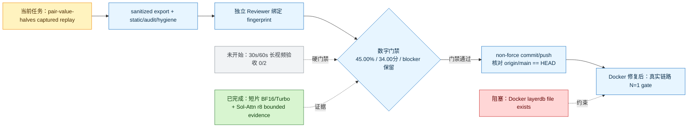

# 研究实时看板 / Live Research Dashboard（中文优先）

[← 返回主 README](README.md) · [当前工作 / Current Work](CURRENT_WORK.md) · [Benchmark Contract v1](benchmark_contract/v1/README.md)

> **更新时间（UTC）：2026-08-13 15:05 UTC** 
> **页面定位：**本文件独立承载研究状态、量化门禁与流程图；主 README 保持原有项目展示版式。 
> **进程状态：**Argus continuous/active 科研工作流快照；Sol-Attn pair-value-halves 候选保持默认关闭，真实链路仍受 Docker storage blocker 限制。 
> **目前正在做什么：**将最新 pair-value-halves captured-metadata replay 作为独立、非 Docker、无模型 kernel milestone 进入 sanitized export/audit/Reviewer 门禁；不把它写成 H3 E2E、长视频、BF16 fidelity 或产品级 speedup。

## 一眼结论（所有数字均带快照时间与证据版本）

- **证据加权总进度：45.00%**（权重表版本：`a6000-long-video-v2026-08-13-dashboard-1`；快照：2026-08-13 15:05 UTC）。该百分比只按已验收里程碑计分，未验收/被阻塞项目计 **0 进度信用**，不按文件数、commit 数、运行时长或主观感觉计分。
- **30s/60s 当前目标：**单张 RTX A6000 上的 720p 级 MiniMax-H3 FL2VA 长视频生产，先 30 秒可复现音视频链路，再 60 秒。
- **长视频产出：0/2 已验收目标**（30s：未验收；60s：未验收）。这是“验收计数为 0”，**不等于模型质量分为 0**；当前没有官方/hidden/held-out 长视频分数。
- **短片 accepted baseline：**原生 1344×768、124 帧、24 FPS、5.166667 秒短片已验收；BF16 warm N=10 median **1792.202 s**，Turbo 8-step N=10 median **290.998 s**（**6.159×** vs BF16），Turbo 4-step N=10 median **149.619 s**（**11.978×** vs BF16，质量风险更高）。
- **Sol-Attn 边界：**r8 真实 H3 5-step opt-in lane 已验收 **15.203%** median HTTP-time improvement（10/10 pairs，阈值 >3%），但不是 50-step BF16、长视频或语义质量结论。最新 pair-value-halves captured replay 仅为 **captured-metadata / 非 Docker / 无模型 kernel 证据**：replay total median **144.652 ms** vs current prefix-skip **175.216 ms**，`max_abs_valid=0`，仍默认关闭，尚无 H3 E2E/长视频/产品级 speedup。
- **Docker blocker：**pinned r2 base image 与 r8/r9 overlay image 当前在本地 Docker daemon 不可 inspect；r2 restore/build 在 layerdb 注册阶段失败（`file exists`）。在 admin 修复或干净 daemon 提供 pinned image 前，不重复同一 Docker restore/build，不运行真实链路 H3 gate。
- **下一真实链路 N=1 gate：**只改变 Q/K/V materialization；必须检查 dense fallback、输出/AV 正确性、copy bytes 和可比端到端时间。N=1 通过后才允许 N=3，再考虑 N≥10。
- **当前门禁评分（研究主线）：34.00/100，状态：BLOCKED/观察。**硬门禁“30s/60s 真实链路尚无已验收输出、Docker gate 阻塞”未通过，不能用综合分掩盖。

## 证据加权总进度表（100% 分母，可审计）

| 里程碑 | 权重 | 完成定义 | 当前信用 | 证据版本/路径 | 结论 |
|---|---:|---|---:|---|---|
| M1 公开基准合同、Schema、证据规范化、CPU/static 与 publication hygiene 基础 | 15% | `benchmark_contract/v1`、公开报告和 sanitized audit/review 基础可复核 | 15% | `benchmark_contract/v1/README.md`; `CURRENT_WORK.md` | 已验收基础能力 |
| M2 5.166667s 短片 BF16 fidelity denominator 与 Turbo practical accepted baseline | 20% | 同一物理 A6000，BF16/Turbo N=10；质量/结构边界公开 | 20% | `CURRENT_WORK.md`; `technical_report/minimax_h3_a6000_performance.md` | 已验收短片基线，不是长视频 |
| M3 Sol-Attn r8 formal matched 5-step opt-in lane | 10% | 10/10 matched pairs，median HTTP-time improvement 超过 3% 阈值，fail-closed 边界公开 | 10% | `technical_report/evidence/minimax_h3_desktop/sol_engine_port/sol_attn_h3_formal_n10_r8_n10_20260812T031757Z/formal_n10_decision.json` | 已验收但仅限 5-step opt-in |
| M4 pair-value-halves 去 materialization 假设进入真实链路 | 10% | 真实 H3 N=1 gate 通过；不是仅 synthetic/model-free replay/harness | 0% | `technical_report/evidence/minimax_h3_desktop/sol_engine_port/sol_attn_pair_value_halves_captured_replay_20260813T145731Z/summary.json`; `CURRENT_WORK.md` | captured-metadata 证据保留，未验收真实链路 |
| M5 30 秒 720p 级可复现音视频链路 | 25% | 单 A6000 产生并验收 30s 输出；AV/质量/耗时边界通过 | 0% | `benchmark_contract/v1/lane-manifests/*30*`（extension/unmeasured）; `CURRENT_WORK.md` | 未测/被 Docker blocker 间接阻塞 |
| M6 60 秒 720p 级可复现音视频链路 | 15% | 单 A6000 产生并验收 60s 输出；AV/质量/耗时边界通过 | 0% | `benchmark_contract/v1/lane-manifests/*60*`（extension/unmeasured）; `CURRENT_WORK.md` | 未测 |
| M7 长视频重复性/泛化与最终发布边界 | 5% | 30/60s 通过后再做多 prompt/seed、N≥3/N≥10、人工质量与 claim 审查 | 0% | 待生成 | 未开始 |
| **合计** | **100%** |  | **45.00%** | 快照：2026-08-13 15:05 UTC | 未验收项未给进度信用 |

## 当前量化效果（N/A/blocked 不写成 0）

| 指标 | 当前值 | Baseline/对照 | Delta | n/denominator | 不确定性/适用边界 | 好/中/差阈值 | 当前结论 | 证据路径 |
|---|---:|---:|---:|---:|---|---|---|---|
| 30s 长视频验收 | N/A（未测；验收计数 0/1） | N/A | N/A | 0/1 accepted target | pinned path 原生只支持 4–15s；真实链路 gate 未运行 | 好=30s N=1 AV+质量+耗时验收；中=结构通过但质量待审；差=失败/泄漏/不可复现 | 未验收，不把 N/A 记作耗时 0 或质量 0 | `CURRENT_WORK.md`; `benchmark_contract/v1/README.md` |
| 60s 长视频验收 | N/A（未测；验收计数 0/1） | N/A | N/A | 0/1 accepted target | 需先通过 30s gate | 好=60s N=1 验收；中=30s 通过但 60s 未测；差=失败/不可复现 | 未开始/未验收 | `CURRENT_WORK.md` |
| 长视频总产出 | 0/2 已验收目标 | N/A | N/A | 0/2 accepted targets | 这是验收计数，不是模型质量分 | 好=2/2；中=1/2；差=0/2 | 当前为 0/2 unaccepted | 本看板 + `CURRENT_WORK.md` |
| BF16 短片 fidelity denominator | median **1792.202 s** | 自身为 fidelity 分母 | N/A | warm N=10 | 1344×768、124 帧、24 FPS、5.166667s；同一物理 A6000 | 好=可复现 N=10 分母；差=无分母 | 已验收短片分母 | `technical_report/minimax_h3_a6000_performance.md`; `CURRENT_WORK.md` |
| Turbo 8-step practical | median **290.998 s** | BF16 1792.202 s | **6.159×** faster | N=10 | disclosed practical approximation，不是 BF16 fidelity | 好=结构/质量边界通过且 >5×；中=2–5×；差=<2×或质量失败 | 推荐 practical 默认短片路线 | `CURRENT_WORK.md`; `technical_report/minimax_h3_a6000_performance.md` |
| Turbo 4-step experimental | median **149.619 s** | BF16 1792.202 s | **11.978×** faster | N=10 | 质量风险更高，24-case 中视觉 11/12 | 好=>10×且质量通过；中=>5×但质量风险；差=质量失败 | 快但非默认 | `CURRENT_WORK.md` |
| Sol-Attn r8 formal 5-step opt-in | median HTTP-time improvement **15.203%** | matched dense 5-step lane | +15.203% | 10/10 pairs | 仅 5-step opt-in；非 BF16/长视频/语义质量 | 好=>3% 且 10/10 pairs/AV pass；中=1–3%；差≤1%或 fallback/AV fail | 已验收 bounded lane | `technical_report/evidence/minimax_h3_desktop/sol_engine_port/sol_attn_h3_formal_n10_r8_n10_20260812T031757Z/formal_n10_decision.json` |
| Sol-Attn pair-value-halves captured replay | replay total **144.652 ms**；forward pointer **129.850 ms**；`max_abs_valid=0` | current prefix-skip **175.216 ms**；forward pointer **158.161 ms** | replay total **17.443%** local model-free gain；forward **17.900%** | repeats=7, model_load=false, docker_used_for_run=false | captured-metadata/非 Docker/无模型 kernel only；默认关闭；无 H3 E2E、无长视频、无产品 speedup | 好=correctness exact 且进入真实链路 gate；中=captured replay clean but no E2E；差=correctness/fallback fail | 保留为下一真实链路假设，进度信用 0% | `technical_report/evidence/minimax_h3_desktop/sol_engine_port/sol_attn_pair_value_halves_captured_replay_20260813T145731Z/summary.json`; `CURRENT_WORK.md` |
| Docker pinned runtime 可用性 | BLOCKED | pinned r2/r8/r9 image 应可 inspect | N/A | preflight/build probe 1 blocker | layerdb `file exists` 属 admin/storage blocker；不重复相同 restore/build | 好=pinned image inspectable；中=clean daemon 可用；差=当前 blocker | 阻塞 N=1 real-chain | source evidence `technical_report/evidence/minimax_h3_desktop/packaging/minimax-h3-r2-restore-build-20260813T074702Z/r2_restore_docker_storage_blocker.json`; `CURRENT_WORK.md` |

## 怎样判断 Argus 当前工作好不好（100 分门禁式规则）

**评分版本：**`argus-quality-gate-v2026-08-13-dashboard-1`；**快照：**2026-08-13 15:05 UTC。公式：

`Score = 0.40 × 主指标/效果 + 0.20 × 泛化与统计 + 0.20 × 正确性与可复现 + 0.10 × 成本效率 + 0.10 × 安全/合规/证据完整性`

| 项 | 权重 | 0–100 可复核映射 | 当前单项 |
|---|---:|---|---:|
| 主指标/效果 | 40 | 100=30s 与 60s 均已验收；70=30s 已验收且 60s 正在 gate；40=只有短片 accepted baseline；0=当前 30s/60s 目标 0/2 已验收 | **0** |
| 泛化与统计 | 20 | 100=长视频 N≥10、多 prompt/seed、人审/结构均过；60=长视频 N≥3；30=只有短片 N=10 与质量套件；0=无可复核样本 | **30** |
| 正确性与可复现 | 20 | 100=真实链路、fallback、AV、测试、sanitized audit 均过；80=短片/contract/static 与 bounded Sol-Attn 证据可复核但真实链路被阻塞；50=只有局部测试；0=正确性失败或不可复现 | **80** |
| 成本效率 | 10 | 100=长视频达到预设成本/时间阈值；60=短片 practical speedup 已验收且长视频待测；40=短片 speedup 有效但 Docker blocker 阻止当前 gate；0=无效率证据 | **40** |
| 安全/合规/证据完整性 | 10 | 100=无凭据/权重/私有路径/raw log 泄漏，claim boundary、audit、Reviewer、remote sync 全过；80=最新已发布公开树干净，且本快照采用非自指提交记录，未把 synthetic/blocked 工作写成结果；0=泄漏或夸大 claim | **80** |
| **综合** | **100** | A/通过 ≥85 且所有硬门禁通过；B/观察 70–84；C/阻塞 50–69；D/失败 <50；任一硬门禁失败时不得用综合分掩盖 | **34.00/100；BLOCKED/观察** |

**硬门禁：**(1) 不把 N/A/blocked 写成 0 分数；(2) 不从 synthetic/model-free harness 推导产品/长视频 speedup；(3) 不泄漏凭据、私有 provider、模型权重、Docker 层、raw log 或 held-out；(4) 真实链路 N=1 未过时，不得宣称 30/60s 达成；(5) 每次发布必须 sanitized audit + 独立 Reviewer + 非 force push + `origin/main == HEAD`。当前硬门禁 (4) 仍阻塞，所以综合分只作诊断，不是通过结论。

## 当前完成后做什么（顺序与验收标准）

1. **当前项：pair-value-halves captured replay sanitized milestone。**验收标准：只发布 captured-metadata / 非 Docker / 无模型 kernel 边界；不改写 BF16/Turbo/r8 formal 数字；候选保持默认关闭、fail-closed。
2. **下一项：publication/safety/static audit + 独立 Reviewer + non-force push。**验收标准：fresh export fingerprint、private/export tests、publication audit、hygiene scans、Reviewer verdict 全部绑定同一候选；随后 `origin/main == HEAD`。
3. **再下一项：Docker blocker 清除后执行真实链路 N=1 gate。**验收标准：只改变 Q/K/V materialization；记录 dense fallback、AV/输出正确性、copy bytes 与可比端到端时间；N=1 通过后才晋级 N=3/N≥10。

## GPT 辅助生成的中文流程图（草案/当前流程，非 Final/Locked）

每条边映射到 `CURRENT_WORK.md` / 本文件、publication audit、Reviewer verdict、Git remote equality、Sol-Attn captured-replay evidence、Docker blocker evidence 与后续 N=1 gate 记录。

## 提交纪律 / Commit discipline

- **最近一次已验证公开发布（本次 captured-replay 候选之前）：**2026-08-13 14:58:30 UTC，`e964ffc`（`docs: include research dashboard in release manifest`），当时已核对 `origin/main == HEAD`。
- **频率规则：**每个有意义且已审查的 milestone 立即非空 commit/push；有实质变化时最长每 3 个活跃小时同步一次；无变化不空提交。
- **页面规则：**后续量化状态更新只改 `RESEARCH_DASHBOARD.md` 与必要的 `CURRENT_WORK.md`；不得再把完整看板放到主 README 标题之前。
- **安全规则：**只 stage 当前里程碑文件；排除凭据、缓存、权重、原始日志、私有/受限材料；禁止 force push；推送后核对 `origin/main == HEAD`。
