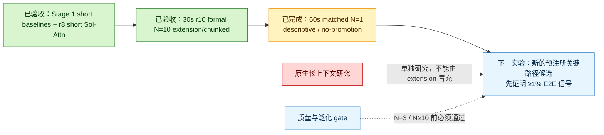

# 研究实时看板 / Live Research Dashboard（中文优先）

[← 返回主 README](README.md) · [当前工作 / Current Work](CURRENT_WORK.md) · [Benchmark Contract v1](benchmark_contract/v1/README.md)

> **更新时间（UTC）：2026-08-17 13:43 UTC** 
> **页面定位：**公开状态、量化门禁、负结果和下一步。主 README 负责展示；`CURRENT_WORK.md` 给出双语边界。 
> **进程状态：**Stage 1 foundation 已验收；Stage 2 有一个 30 秒 formal r10 N=10 accepted 结果，60 秒 matched N=1 已完整跑通但因冻结转场 proxy 红旗仅为 descriptive/no-promotion。 
> **核心边界：**30/60 秒均为 practical/approximate Turbo + Sol-Attn extension/chunked，不是 native long context、BF16 fidelity、产品就绪、公开对比或 SOTA 结论。

## 一眼结论

- **Stage 1 accepted foundation：45/45。** 公开 benchmark contract、短片 BF16/Turbo accepted baseline、Sol-Attn r8 formal 5-step opt-in 有界证据已验收。
- **Stage 2 long-video objective：25/55。** 30 秒 formal r10 timing/structural 结果已验收；60 秒已完成 N=1 描述性测量，但 formal 晋级、泛化质量和产品就绪仍未验收。
- **长视频目标：1/2 bounded lanes accepted。** 30 秒：formal accepted；60 秒：1440 帧/1,920,000 samples/channel 完整，但 descriptive/no-promotion，不计 accepted-lane 信用。
- **30 秒 r10 formal N=10：**候选 `r10_adaptive_tau1_5_step3_diag` 对保留 `r9_current_sol_attn`，同一单张 A6000、同一 workload fingerprint、同一 timing boundary；warm E2E median **1333.575 s** vs **1394.006 s**，median improvement **4.326%**；cold median **1814.134 s** vs **1884.142 s**；10/10 pairs final-AV 完整。
- **30 秒 final AV accounting：**每个候选/参考输出均为 1344×768、720 帧、24 FPS、32 kHz 双声道，960,000 effective samples/channel，six-chunk `extension` assembly。
- **短片 accepted baseline：**BF16 warm N=10 median **1792.202 s**；Turbo 8-step N=10 median **290.998 s**（**6.159×** vs BF16）；Turbo 4-step N=10 median **149.619 s**（**11.978×** vs BF16，质量风险更高）。
- **Sol-Attn r8 短片边界：**formal 5-step opt-in lane 已验收 **15.203%** median HTTP-time improvement（10/10 pairs），但不是 50-step BF16、长视频或语义质量结论。
- **60 秒 N=1：**r10 warm E2E **2682.008 s** vs r9 **2802.991 s**，单样本信号 **4.316%**；两边均触发 `near_frozen_transition_fraction`，不启动 N=3/N≥10。
- **下一项：**新的预注册关键路径候选；禁止重复不变的 60 秒配置，真实 native long-context 研究继续保持单独标签。

## 证据加权进度表（100% 分母，可审计）

| Stage | 里程碑 | 权重 | 完成定义 | 当前信用 | 证据版本/路径 | 结论 |
|---|---|---:|---|---:|---|---|
| Stage 1 | M1 公开基准合同、Schema、证据规范化、CPU/static 与 publication hygiene 基础 | 15% | `benchmark_contract/v1`、公开报告和 sanitized audit/review 基础可复核 | 15% | `benchmark_contract/v1/README.md`; `CURRENT_WORK.md` | 已验收基础能力 |
| Stage 1 | M2 5.166667s 短片 BF16 fidelity denominator 与 Turbo practical accepted baseline | 20% | 同一物理 A6000，BF16/Turbo N=10；质量/结构边界公开 | 20% | `technical_report/minimax_h3_a6000_performance.md` | 已验收短片基线，不是长视频 |
| Stage 1 | M3 Sol-Attn r8 formal matched 5-step opt-in lane | 10% | 10/10 matched pairs，median HTTP-time improvement 超过 3% 阈值，fail-closed 边界公开 | 10% | `technical_report/evidence/minimax_h3_desktop/sol_engine_port/sol_attn_h3_formal_n10_r8_n10_20260812T031757Z/formal_n10_decision.json` | 已验收但仅限 5-step opt-in 短片 lane |
| Stage 2 | M4 30 秒 final-AV extension/chunked formal r10 | 25% | 单 A6000、matched formal N=10、final-AV 完整、同一 workload/timing/GPU 边界、Reviewer 接受；不要求 native context 或人工质量 | 25% | `benchmark_contract/v1/normalized-records/final-av-30s-r10-guarded-adaptive-step3-formal-n10.json`; `technical_report/evidence/minimax_h3_desktop/long_video/final-av-30s-r10-step3-guarded-adaptive-sol-attn-formal-n10-20260816T052452Z/formal_n10_summary.json` | 已验收有界 timing/structural 结果 |
| Stage 2 | M5 60 秒 final-AV extension/chunked lane | 15% | 单 A6000 产生并验收 60s 输出，AV/资源/耗时边界通过 | 0% | `benchmark_contract/v1/lane-manifests/final-av-60s-1344x768-24fps-v1.json`; per-run 60s decision | N=1 完整但自动质量红旗导致 no-promotion，尚不计验收信用 |
| Stage 2 | M6 长视频泛化、人工质量与最终产品边界 | 10% | 30/60s 通过后，多 prompt/seed、N≥3/N≥10、人工质量与 claim 审查 | 0% | 待生成 | 未开始 |
|  | **合计** | **100%** |  | **70%** | 快照：2026-08-17 13:43 UTC | Stage 1 = 45/45；Stage 2 = 25/55；60s descriptive evidence 不虚增信用 |

## 当前量化效果（N/A/blocked 不写成 0）

| 指标 | 当前值 | Baseline/对照 | Delta | n/denominator | 不确定性/适用边界 | 当前结论 |
|---|---:|---:|---:|---:|---|---|
| 30s final-AV extension/chunked | candidate warm median **1333.575 s** | retained r9 warm median **1394.006 s** | **4.326%** median improvement | formal matched N=10 | 单 A6000、同 workload/timing boundary、Turbo practical + Sol-Attn；不是 native/BF16/human-quality/product/SOTA | 已验收有界 timing/structural result |
| 30s cold E2E | candidate cold median **1814.134 s** | retained r9 cold median **1884.142 s** | **3.669%** median improvement | formal matched N=10 | cold includes startup/load/compile under recorded boundary | 已验收有界 cold distribution |
| 30s seconds/generated second | candidate **44.453 s/s** | retained r9 **46.467 s/s** | follows warm E2E delta | N=10 | exact final duration 30 s | 已验收有界 efficiency metric |
| 30s resource median | GPU **27,946 MiB**, host **250.036 GiB**, power **300.32 W**, failures **0** | retained r9 GPU **27,946 MiB**, host **249.652 GiB**, power **300.07 W**, failures **0** | no failure delta | N=10 | host/GPU resource telemetry is local to this A6000 setup | Resource envelope recorded |
| 60s final-AV extension/chunked | r10 warm **2682.008 s** | r9 warm **2802.991 s** | N=1 **4.316% route signal** | matched N=1 | 1440 帧/1,920,000 samples/channel 完整；两边均有 frozen-transition proxy flag | descriptive/no-promotion，不是 formal speedup |
| BF16 短片 fidelity denominator | median **1792.202 s** | 自身为 fidelity 分母 | N/A | warm N=10 | 1344×768、124 帧、24 FPS、5.166667s；同一物理 A6000 | 已验收短片分母 |
| Turbo 8-step practical short | median **290.998 s** | BF16 1792.202 s | **6.159×** faster | N=10 | disclosed practical approximation，不是 BF16 fidelity | 推荐 practical 默认短片路线 |
| Turbo 4-step experimental short | median **149.619 s** | BF16 1792.202 s | **11.978×** faster | N=10 | 质量风险更高，24-case 中视觉 11/12 | 快但非默认 |
| Sol-Attn r8 short formal 5-step opt-in | median HTTP-time improvement **15.203%** | matched dense 5-step lane | +15.203% | 10/10 pairs | 仅 5-step opt-in；非 BF16/长视频/语义质量 | 已验收 bounded short lane |

## Post-dashboard negative probes / 看板后负结果（边界保留）

| Probe / 探针 | Correctness / 正确性 | Timing / 计时 | Decision / 决策边界 |
|---|---|---|---|
| `num_warps=8` forward config | exact vs retained lane | candidate **373.673 ms** vs current **181.965 ms** | exact but much slower; reverted; model-free only |
| paired-exact grouping | exact vs retained lane | modeled loop reduction **45.680%**, but whole-lane regression **4.955%** | rejected/reverted; no H3 E2E or long-video claim |
| full-K exact fast | not bit-exact; `max_abs_valid=0.0001220703125` | candidate **175.182 ms** vs current **145.071 ms** | slower and not exact; rejected/reverted |
| padded-query unmask | not bit-exact; `max_abs_valid=0.0233154296875` | apparent whole-lane difference **0.043%**, forward regressed **-0.323%** | rejected/reverted; no promotion |
| PV128-dot | omitted until independent review | omitted until independent review | no public product/long-video speedup claim |

## 当前硬门禁 / Current hard gates

1. **Native long context:** still **not accepted**; the 30s result is `extension`/chunked.
2. **BF16 fidelity:** still **not accepted** for r10; r10 is practical approximate Turbo + Sol-Attn.
3. **Human semantic/audio quality:** still **not accepted**; objective proxies and structural AV do not certify perceived quality.
4. **60 seconds:** full matched N=1 output exists, but formal acceptance is still blocked by automatic frozen-transition flags.
5. **Publication hygiene:** every public update must pass sanitized export, prohibited-term/secret/large-file/model/cache/raw-log/private-path checks, Reviewer-bound claim acceptance, non-force push, and remote equality.

## 当前流程图 / Current flow

## 提交纪律 / Commit discipline

- 每个有意义且已审查的 milestone 非空 commit/push；无变化不空提交。
- 只发布代码、报告、Schema、小型 JSON 和 curated 示例；不发布权重、secrets、cache、raw logs、Docker layers、未审查媒体或私有路径。
- 禁止 force push、tag、release 或 PR；推送后必须核对 `origin/main == HEAD`。
